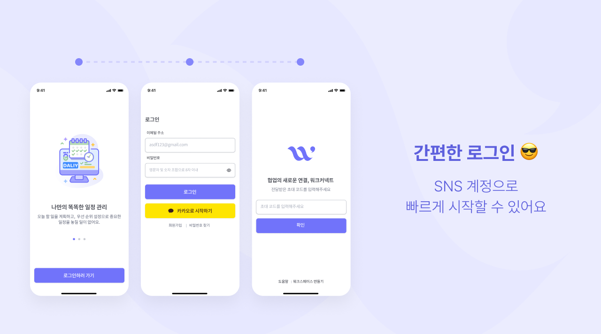
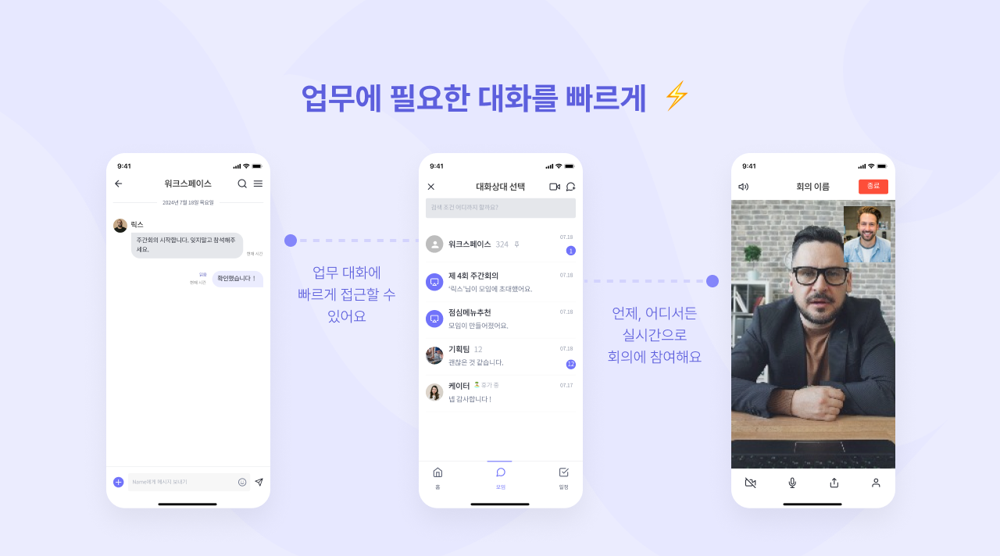
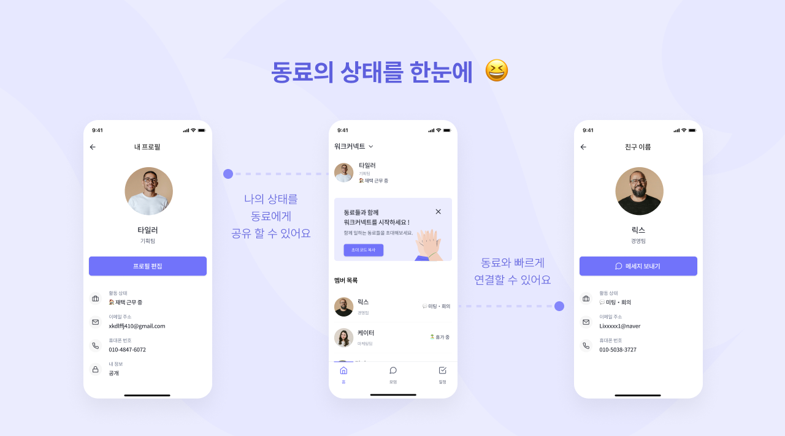
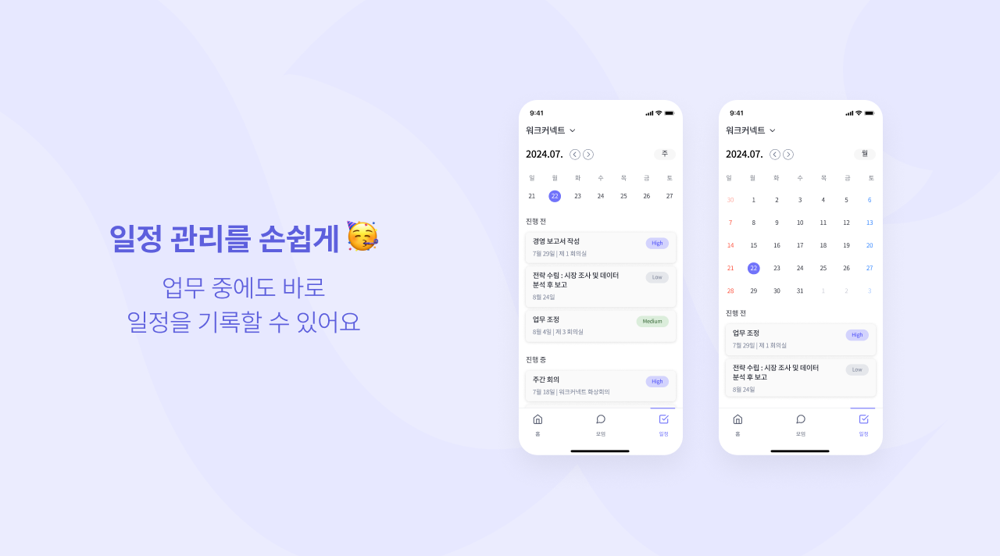
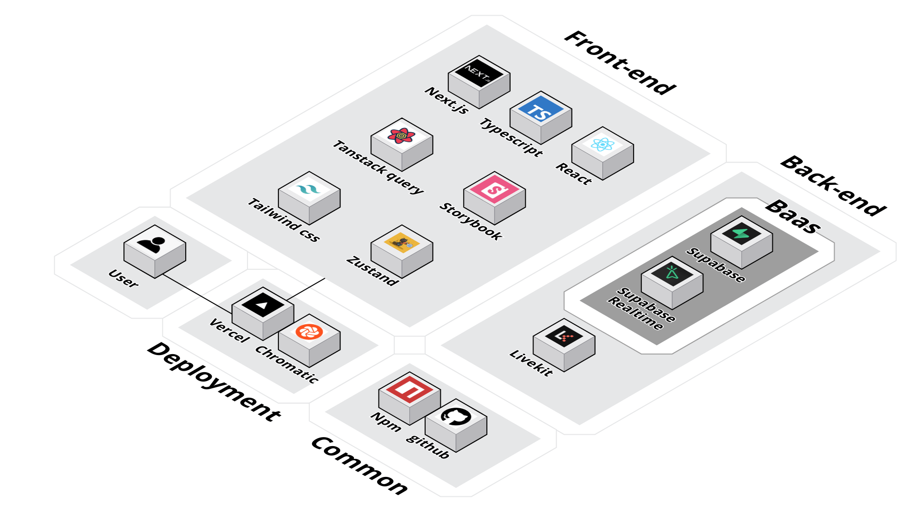
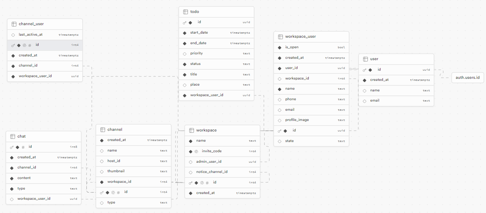

<h1>WorkConnect</h1>


<h2>📝 프로젝트 소개</h2>

협업을 위해 여러 서비스를 사용해야 하는 현대인들을 위한 통합 워크스페이스 서비스입니다.

- 상세 소개
  - 사용자들 간 개인 혹은 그룹으로 채팅방을 만들어 메세지나 파일을 전달할 수 있습니다.
  - 화상 채팅을 통해 실시간으로 얼굴을 보며 대화를 할 수 있습니다.
  - 사용자의 일정을 기록해두고, 확인할 수 있습니다.

<h2>🌐 배포 주소</h2>

[WorkConnect 이동하기](https://work-connect-plum.vercel.app/)

[Storybook 이동하기](https://66c3904f6e0476eb4df0516b-juqaubooaa.chromatic.com/?path=/docs/components-bottomlinetextfield--docs)

## 👥 팀원소개

|                                          김형빈                                          |                                    김민곤                                     |                                    강해원                                     |                                     유태윤                                     |                                    이예린                                     |
| :--------------------------------------------------------------------------------------: | :---------------------------------------------------------------------------: | :---------------------------------------------------------------------------: | :----------------------------------------------------------------------------: | :---------------------------------------------------------------------------: |
|             |  |  |  |  |
|                                           리더                                           |                                    부리더                                     |                                     팀원                                      |                                      팀원                                      |                                     팀원                                      |
|                           [hb9901](https://github.com/hb9901)                            |                   [MinKonKim](https://github.com/MinKonKim)                   |                   [riverSun1](https://github.com/riverSun1)                   |                    [taeyun01](https://github.com/taeyun01)                     |                    [1eeyerin](https://github.com/1eeyerin)                    |
| <div>메인 페이지</div> <div>프로필 페이지</div><div>일정 페이지</div><div>레이아웃</div> |                             <div>화상 채팅</div>                              |                  <div>공통 컴포넌트</div><div>스토리북</div>                  |       <div>회원 가입</div> <div>로그인</div><div>워크스페이스 생성</div>       |        <div>실시간 채팅</div><div>채널 목록</div><div>파일 관리</div>         |

<br/>

## 📖 주요 기능






## 📌 서비스 아키텍처



## 📌 ERD



## 🛠️ Stacks

#### ✔️ Packages Manager


#### ✔️ Language & Framework


#### ✔️ State management


#### ✔️ Design System & Style


#### ✔️ Database


#### ✔️ Solution


#### ✔️ UI Component


#### ✔️ Deployment


#### ✔️ Communication


<br />

## 🚀 시작 가이드

### Installation

```bash
git clone https://github.com/B03-Killer/WorkConnect.git
cd WorkConnect
```

### Frontend

```bash
npm run dev
```

### StoryBook

```bash
npm run build-storybook
npm run storybook
```

### .env.local

```bash
NEXT_PUBLIC_SUPABASE_URL
NEXT_PUBLIC_SUPABASE_ANON_KEY
NEXT_PUBLIC_API_URL

LIVEKIT_API_KEY
LIVEKIT_API_SECRET
NEXT_PUBLIC_LIVEKIT_URL

SENTRY_AUTH_TOKEN
```

### supabase 타입 업데이트

- 토큰 만료시 재 로그인 필요

```bash
npx supabase login
npm run gen
```

## 🔍로컬 서버 주소

- dev
  - http://localhost:3100
- storybook
  - http://localhost:6006

<br/>

## 📁 프로젝트 구조

<details><summary>프로젝트 구조 확인하기</summary>

```
📦WorkConnect
 ┣ 📂.storybook
 ┣ 📂.vscode
 ┣ 📂public
 ┃ ┣ 📂images
 ┃ ┃ ┣ 📂common
 ┃ ┃ ┣ 📂favicons
 ┃ ┃ ┗ 📂onboarding
 ┃ ┣ 📂lotties
 ┣ 📂src
 ┃ ┣ 📂api
 ┃ ┣ 📂app
 ┃ ┃ ┣ 📂(providers)
 ┃ ┃ ┃ ┣ 📂(root)
 ┃ ┃ ┃ ┃ ┣ 📂auth
 ┃ ┃ ┃ ┃ ┃ ┣ 📂kakao
 ┃ ┃ ┃ ┃ ┃ ┃ ┗ 📜page.tsx
 ┃ ┃ ┃ ┃ ┃ ┣ 📂signup
 ┃ ┃ ┃ ┃ ┃ ┃ ┣ 📂verify
 ┃ ┃ ┃ ┃ ┃ ┃ ┃ ┣ 📂_hooks
 ┃ ┃ ┃ ┃ ┃ ┃ ┃ ┣ 📂_utils
 ┃ ┃ ┃ ┃ ┃ ┃ ┃ ┗ 📜page.tsx
 ┃ ┃ ┃ ┃ ┃ ┃ ┣ 📂_components
 ┃ ┃ ┃ ┃ ┃ ┃ ┣ 📂_hooks
 ┃ ┃ ┃ ┃ ┃ ┃ ┗ 📜page.tsx
 ┃ ┃ ┃ ┃ ┃ ┗ 📂_utils
 ┃ ┃ ┃ ┃ ┣ 📂password-find
 ┃ ┃ ┃ ┃ ┃ ┣ 📂reset
 ┃ ┃ ┃ ┃ ┃ ┃ ┗ 📜page.tsx
 ┃ ┃ ┃ ┃ ┃ ┣ 📂verify
 ┃ ┃ ┃ ┃ ┃ ┃ ┣ 📂_components
 ┃ ┃ ┃ ┃ ┃ ┃ ┗ 📜page.tsx
 ┃ ┃ ┃ ┃ ┃ ┣ 📂_hooks
 ┃ ┃ ┃ ┃ ┃ ┗ 📜page.tsx
 ┃ ┃ ┃ ┃ ┣ 📂welcome
 ┃ ┃ ┃ ┃ ┃ ┗ 📜page.tsx
 ┃ ┃ ┃ ┃ ┣ 📂workspace
 ┃ ┃ ┃ ┃ ┃ ┣ 📂landing
 ┃ ┃ ┃ ┃ ┃ ┃ ┣ 📂_hooks
 ┃ ┃ ┃ ┃ ┃ ┃ ┣ 📜constants.ts
 ┃ ┃ ┃ ┃ ┃ ┃ ┗ 📜page.tsx
 ┃ ┃ ┃ ┃ ┃ ┗ 📂new
 ┃ ┃ ┃ ┃ ┃ ┃ ┣ 📂_hook
 ┃ ┃ ┃ ┃ ┃ ┃ ┣ 📂_utils
 ┃ ┃ ┃ ┃ ┃ ┃ ┗ 📜page.tsx
 ┃ ┃ ┃ ┃ ┣ 📂[workspaceId]
 ┃ ┃ ┃ ┃ ┃ ┣ 📂(home)
 ┃ ┃ ┃ ┃ ┃ ┃ ┣ 📜layout.tsx
 ┃ ┃ ┃ ┃ ┃ ┃ ┣ 📜loading.tsx
 ┃ ┃ ┃ ┃ ┃ ┃ ┗ 📜page.tsx
 ┃ ┃ ┃ ┃ ┃ ┣ 📂channels
 ┃ ┃ ┃ ┃ ┃ ┃ ┣ 📂(chat)
 ┃ ┃ ┃ ┃ ┃ ┃ ┃ ┣ 📂[id]
 ┃ ┃ ┃ ┃ ┃ ┃ ┃ ┃ ┣ 📂(home)
 ┃ ┃ ┃ ┃ ┃ ┃ ┃ ┃ ┃ ┣ 📂_components
 ┃ ┃ ┃ ┃ ┃ ┃ ┃ ┃ ┃ ┣ 📂_hooks
 ┃ ┃ ┃ ┃ ┃ ┃ ┃ ┃ ┃ ┣ 📂_provider
 ┃ ┃ ┃ ┃ ┃ ┃ ┃ ┃ ┃ ┣ 📂_util
 ┃ ┃ ┃ ┃ ┃ ┃ ┃ ┃ ┃ ┣ 📜layout.tsx
 ┃ ┃ ┃ ┃ ┃ ┃ ┃ ┃ ┃ ┗ 📜page.tsx
 ┃ ┃ ┃ ┃ ┃ ┃ ┃ ┃ ┗ 📂(resource)
 ┃ ┃ ┃ ┃ ┃ ┃ ┃ ┃ ┃ ┣ 📂file
 ┃ ┃ ┃ ┃ ┃ ┃ ┃ ┃ ┃ ┃ ┗ 📜page.tsx
 ┃ ┃ ┃ ┃ ┃ ┃ ┃ ┃ ┃ ┣ 📂media
 ┃ ┃ ┃ ┃ ┃ ┃ ┃ ┃ ┃ ┃ ┗ 📜page.tsx
 ┃ ┃ ┃ ┃ ┃ ┃ ┃ ┃ ┃ ┣ 📂notice
 ┃ ┃ ┃ ┃ ┃ ┃ ┃ ┃ ┃ ┃ ┗ 📜page.tsx
 ┃ ┃ ┃ ┃ ┃ ┃ ┃ ┃ ┃ ┣ 📂_components
 ┃ ┃ ┃ ┃ ┃ ┃ ┃ ┃ ┃ ┗ 📜layout.tsx
 ┃ ┃ ┃ ┃ ┃ ┃ ┃ ┣ 📂_components
 ┃ ┃ ┃ ┃ ┃ ┃ ┃ ┣ 📂_constants
 ┃ ┃ ┃ ┃ ┃ ┃ ┃ ┣ 📂_hook
 ┃ ┃ ┃ ┃ ┃ ┃ ┃ ┗ 📂_utils
 ┃ ┃ ┃ ┃ ┃ ┃ ┣ 📂(home)
 ┃ ┃ ┃ ┃ ┃ ┃ ┃ ┣ 📜layout.tsx
 ┃ ┃ ┃ ┃ ┃ ┃ ┃ ┗ 📜page.tsx
 ┃ ┃ ┃ ┃ ┃ ┃ ┣ 📂add
 ┃ ┃ ┃ ┃ ┃ ┃ ┃ ┣ 📂(home)
 ┃ ┃ ┃ ┃ ┃ ┃ ┃ ┃ ┗ 📜page.tsx
 ┃ ┃ ┃ ┃ ┃ ┃ ┃ ┣ 📂group-setting
 ┃ ┃ ┃ ┃ ┃ ┃ ┃ ┃ ┣ 📂_components
 ┃ ┃ ┃ ┃ ┃ ┃ ┃ ┃ ┗ 📜page.tsx
 ┃ ┃ ┃ ┃ ┃ ┃ ┃ ┣ 📂_components
 ┃ ┃ ┃ ┃ ┃ ┃ ┃ ┣ 📂_hooks
 ┃ ┃ ┃ ┃ ┃ ┃ ┃ ┣ 📂_provider
 ┃ ┃ ┃ ┃ ┃ ┃ ┃ ┣ 📂_utils
 ┃ ┃ ┃ ┃ ┃ ┃ ┃ ┗ 📜layout.tsx
 ┃ ┃ ┃ ┃ ┃ ┃ ┣ 📂_components
 ┃ ┃ ┃ ┃ ┃ ┃ ┣ 📂_constants
 ┃ ┃ ┃ ┃ ┃ ┃ ┣ 📂_hooks
 ┃ ┃ ┃ ┃ ┃ ┃ ┗ 📂_utils
 ┃ ┃ ┃ ┃ ┃ ┣ 📂profile
 ┃ ┃ ┃ ┃ ┃ ┃ ┗ 📂[targetWorkspaceUserId]
 ┃ ┃ ┃ ┃ ┃ ┃ ┃ ┣ 📂@home
 ┃ ┃ ┃ ┃ ┃ ┃ ┃ ┃ ┣ 📂(..)(..)(home)
 ┃ ┃ ┃ ┃ ┃ ┃ ┃ ┃ ┃ ┗ 📜page.tsx
 ┃ ┃ ┃ ┃ ┃ ┃ ┃ ┃ ┗ 📜default.tsx
 ┃ ┃ ┃ ┃ ┃ ┃ ┃ ┣ 📂edit
 ┃ ┃ ┃ ┃ ┃ ┃ ┃ ┃ ┣ 📂_components
 ┃ ┃ ┃ ┃ ┃ ┃ ┃ ┃ ┣ 📂_hooks
 ┃ ┃ ┃ ┃ ┃ ┃ ┃ ┃ ┣ 📜loading.tsx
 ┃ ┃ ┃ ┃ ┃ ┃ ┃ ┃ ┗ 📜page.tsx
 ┃ ┃ ┃ ┃ ┃ ┃ ┃ ┣ 📂_components
 ┃ ┃ ┃ ┃ ┃ ┃ ┃ ┣ 📜layout.tsx
 ┃ ┃ ┃ ┃ ┃ ┃ ┃ ┣ 📜loading.tsx
 ┃ ┃ ┃ ┃ ┃ ┃ ┃ ┗ 📜page.tsx
 ┃ ┃ ┃ ┃ ┃ ┣ 📂to-do-list
 ┃ ┃ ┃ ┃ ┃ ┃ ┣ 📂(home)
 ┃ ┃ ┃ ┃ ┃ ┃ ┃ ┣ 📜layout.tsx
 ┃ ┃ ┃ ┃ ┃ ┃ ┃ ┣ 📜loading.tsx
 ┃ ┃ ┃ ┃ ┃ ┃ ┃ ┗ 📜page.tsx
 ┃ ┃ ┃ ┃ ┃ ┃ ┣ 📂add
 ┃ ┃ ┃ ┃ ┃ ┃ ┃ ┗ 📂[id]
 ┃ ┃ ┃ ┃ ┃ ┃ ┃ ┃ ┣ 📂@todolist
 ┃ ┃ ┃ ┃ ┃ ┃ ┃ ┃ ┃ ┣ 📂(..)(..)(..)(to-do-list)
 ┃ ┃ ┃ ┃ ┃ ┃ ┃ ┃ ┃ ┃ ┗ 📜page.tsx
 ┃ ┃ ┃ ┃ ┃ ┃ ┃ ┃ ┃ ┗ 📜default.tsx
 ┃ ┃ ┃ ┃ ┃ ┃ ┃ ┃ ┣ 📂_components
 ┃ ┃ ┃ ┃ ┃ ┃ ┃ ┃ ┣ 📂_hooks
 ┃ ┃ ┃ ┃ ┃ ┃ ┃ ┃ ┣ 📜layout.tsx
 ┃ ┃ ┃ ┃ ┃ ┃ ┃ ┃ ┣ 📜loading.tsx
 ┃ ┃ ┃ ┃ ┃ ┃ ┃ ┃ ┗ 📜page.tsx
 ┃ ┃ ┃ ┃ ┃ ┃ ┗ 📂_components
 ┃ ┃ ┃ ┃ ┃ ┣ 📂user
 ┃ ┃ ┃ ┃ ┃ ┃ ┣ 📜Logout.tsx
 ┃ ┃ ┃ ┃ ┃ ┃ ┗ 📜page.tsx
 ┃ ┃ ┃ ┃ ┃ ┣ 📂video-channel
 ┃ ┃ ┃ ┃ ┃ ┃ ┣ 📂(main)
 ┃ ┃ ┃ ┃ ┃ ┃ ┃ ┣ 📂prejoin
 ┃ ┃ ┃ ┃ ┃ ┃ ┃ ┃ ┣ 📂_components
 ┃ ┃ ┃ ┃ ┃ ┃ ┃ ┃ ┗ 📜page.tsx
 ┃ ┃ ┃ ┃ ┃ ┃ ┃ ┣ 📂[name]
 ┃ ┃ ┃ ┃ ┃ ┃ ┃ ┃ ┣ 📂_components
 ┃ ┃ ┃ ┃ ┃ ┃ ┃ ┃ ┣ 📂_hooks
 ┃ ┃ ┃ ┃ ┃ ┃ ┃ ┃ ┣ 📂_store
 ┃ ┃ ┃ ┃ ┃ ┃ ┃ ┃ ┣ 📂_types
 ┃ ┃ ┃ ┃ ┃ ┃ ┃ ┃ ┣ 📂_utils
 ┃ ┃ ┃ ┃ ┃ ┃ ┃ ┃ ┗ 📜page.tsx
 ┃ ┃ ┃ ┃ ┃ ┃ ┃ ┣ 📂_components
 ┃ ┃ ┃ ┃ ┃ ┃ ┃ ┗ 📂_constants
 ┃ ┃ ┃ ┃ ┃ ┃ ┗ 📂_hooks
 ┃ ┃ ┃ ┃ ┃ ┗ 📂_components
 ┃ ┃ ┃ ┃ ┣ 📂_components
 ┃ ┃ ┃ ┃ ┃ ┗ 📂Splash
 ┃ ┃ ┃ ┃ ┣ 📂_hook
 ┃ ┃ ┃ ┃ ┣ 📂_utils
 ┃ ┃ ┃ ┃ ┣ 📜layout.tsx
 ┃ ┃ ┃ ┃ ┗ 📜page.tsx
 ┃ ┃ ┃ ┗ 📜layout.tsx
 ┃ ┃ ┣ 📂api
 ┃ ┃ ┃ ┣ 📂channel
 ┃ ┃ ┃ ┃ ┣ 📂(home)
 ┃ ┃ ┃ ┃ ┣ 📂existing-id
 ┃ ┃ ┃ ┃ ┣ 📂id
 ┃ ┃ ┃ ┃ ┗ 📂[id]
 ┃ ┃ ┃ ┃ ┃ ┣ 📂info
 ┃ ┃ ┃ ┃ ┃ ┣ 📂resource
 ┃ ┃ ┃ ┃ ┃ ┃ ┣ 📂documents
 ┃ ┃ ┃ ┃ ┃ ┃ ┣ 📂media
 ┃ ┃ ┃ ┃ ┃ ┃ ┗ 📂notices
 ┃ ┃ ┃ ┃ ┃ ┣ 📂update-active-at
 ┃ ┃ ┃ ┃ ┃ ┗ 📂users
 ┃ ┃ ┃ ┣ 📂channel-user
 ┃ ┃ ┃ ┣ 📂channels
 ┃ ┃ ┃ ┃ ┗ 📂(home)
 ┃ ┃ ┃ ┣ 📂chat
 ┃ ┃ ┃ ┃ ┗ 📂[id]
 ┃ ┃ ┃ ┃ ┃ ┣ 📂latest-notice
 ┃ ┃ ┃ ┣ 📂contact
 ┃ ┃ ┃ ┣ 📂get-participant-token
 ┃ ┃ ┃ ┣ 📂signup
 ┃ ┃ ┃ ┃ ┣ 📂emai
 ┃ ┃ ┃ ┃ ┗ 📂kakao
 ┃ ┃ ┃ ┣ 📂storage
 ┃ ┃ ┃ ┣ 📂supabase-storage-profile
 ┃ ┃ ┃ ┣ 📂todo
 ┃ ┃ ┃ ┣ 📂workspace
 ┃ ┃ ┃ ┃ ┗ 📂[id]
 ┃ ┃ ┃ ┃ ┃ ┗ 📂users
 ┃ ┃ ┃ ┃ ┃ ┃ ┗ 📂search
 ┃ ┃ ┃ ┣ 📂workspace-list
 ┃ ┃ ┃ ┣ 📂workspace-user
 ┃ ┃ ┃ ┗ 📂workspace-userlist
 ┃ ┃ ┣ 📜layout.tsx
 ┃ ┃ ┣ 📜loading.tsx
 ┃ ┃ ┗ 📜not-found.tsx
 ┃ ┣ 📂assets
 ┃ ┣ 📂components
 ┃ ┣ 📂constants
 ┃ ┣ 📂icons
 ┃ ┣ 📂providers
 ┃ ┣ 📂services
 ┃ ┣ 📂store
 ┃ ┣ 📂styles
 ┃ ┣ 📂types
 ┃ ┣ 📂utils
 ┃ ┃ ┣ 📂cookie
 ┃ ┃ ┣ 📂middleware
 ┃ ┃ ┣ 📂supabase
 ┃ ┣ 📜instrumentation.ts
 ┃ ┗ 📜middleware.ts
 ┣ 📂supabase
```

</details>

## 🔗참고 사이트

- `Notion`: [팀 노션 방문하기](https://www.notion.so/teamsparta/0c5056fc528f4b91bc0ba88172daaf78)

- `Notion`: [브로셔 확인하기](https://teamsparta.notion.site/B03-75f42a34908f4966984c0686b5e5443e)
