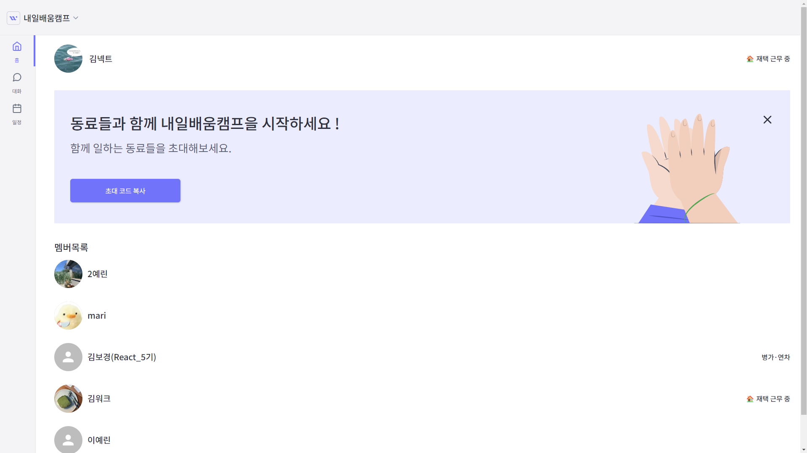
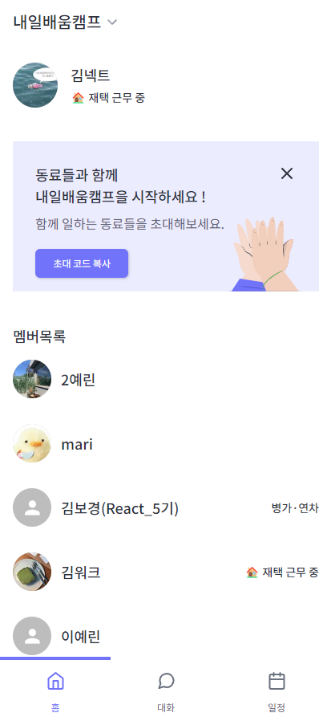
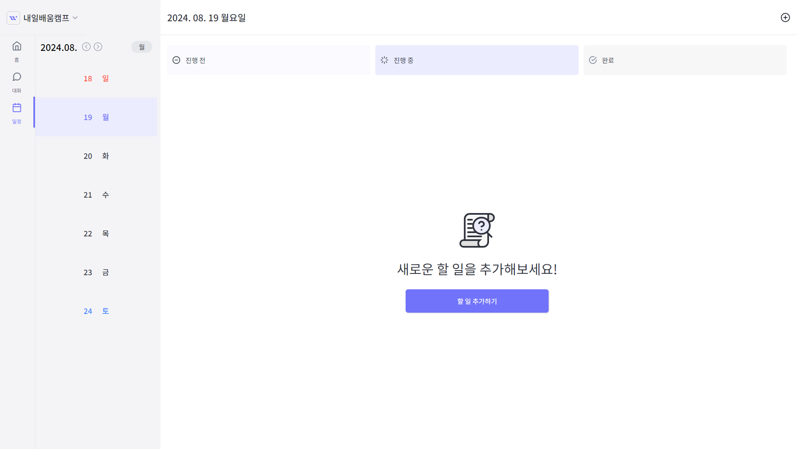
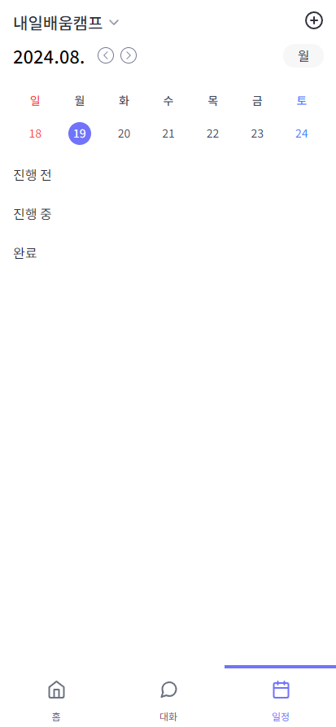

<h1 style="color:#7173FA">WorkConnect</h1>


<h2>📝 기획</h2>

협업을 위해 여러 서비스를 사용해야 하는 현대인들을 위한 통합 워크스페이스 서비스입니다.

<h2>🌐 서비스 링크</h2>

[WorkConnect 이동하기](https://work-connect-plum.vercel.app/)

## 👥 팀원소개

|                                          김형빈                                          |                                    김민곤                                    |                                    강해원                                    |                                    유태윤                                     |                                    이예린                                    |
| :--------------------------------------------------------------------------------------: | :--------------------------------------------------------------------------: | :--------------------------------------------------------------------------: | :---------------------------------------------------------------------------: | :--------------------------------------------------------------------------: |
|              |  |  |  |  |
|                                           리더                                           |                                    부리더                                    |                                     팀원                                     |                                     팀원                                      |                                     팀원                                     |
|                           [hb9901](https://github.com/hb9901)                            |                  [MinKonKim](https://github.com/MinKonKim)                   |                  [riverSun1](https://github.com/riverSun1)                   |                    [taeyun01](https://github.com/taeyun01)                    |                   [1eeyerin](https://github.com/1eeyerin)                    |
| <div>메인 페이지</div> <div>프로필 페이지</div><div>일정 페이지</div><div>레이아웃</div> |                             <div>화상 채팅</div>                             |                           <div>공용 레이아웃</div>                           |      <div>회원 가입</div> <div>로그인</div><div>워크스페이스 생성</div>       |        <div>실시간 채팅</div><div>채널 목록</div><div>파일 관리</div>        |

<br/>

## 🛠️ Tools

### 개발환경


### Communication


<br />

## 시작하기

```bash
npm run dev
npm run build-storybook
npm run storybook
```

## 로컬 서버 주소

- dev
  - http://localhost:3100
- storybook
  - http://localhost:6006

## .env.local

```bash
NEXT_PUBLIC_SUPABASE_URL
NEXT_PUBLIC_SUPABASE_ANON_KEY
NEXT_PUBLIC_API_URL

LIVEKIT_API_KEY
LIVEKIT_API_SECRET
NEXT_PUBLIC_LIVEKIT_URL

SENTRY_AUTH_TOKEN
```

## supabase 타입 업데이트

- 토큰 만료시 재 로그인 필요

```bash
npx supabase login
npm run gen
```

<br/>

## 📌 서비스 아키텍처


## 📌 ERD


## 📖 실제 구현 화면

|   페이지    |                                                   Pc 화면                                                    |                                                   Mobile 화면                                                    |
| :---------: | :----------------------------------------------------------------------------------------------------------: | :--------------------------------------------------------------------------------------------------------------: |
| 메인 페이지 |  |  |
| 일정 페이지 |             |             |

## 📁 프로젝트 구조

<details><summary>프로젝트 구조 확인하기</summary>

```
📦WorkConnect
 ┣ 📂.git
 ┃ ┣ 📂hooks
 ┃ ┃ ┣ 📜applypatch-msg.sample
 ┃ ┃ ┣ 📜commit-msg.sample
 ┃ ┃ ┣ 📜fsmonitor-watchman.sample
 ┃ ┃ ┣ 📜post-update.sample
 ┃ ┃ ┣ 📜pre-applypatch.sample
 ┃ ┃ ┣ 📜pre-commit.sample
 ┃ ┃ ┣ 📜pre-merge-commit.sample
 ┃ ┃ ┣ 📜pre-push.sample
 ┃ ┃ ┣ 📜pre-rebase.sample
 ┃ ┃ ┣ 📜pre-receive.sample
 ┃ ┃ ┣ 📜prepare-commit-msg.sample
 ┃ ┃ ┣ 📜push-to-checkout.sample
 ┃ ┃ ┣ 📜sendemail-validate.sample
 ┃ ┃ ┗ 📜update.sample
 ┃ ┣ 📂info
 ┃ ┃ ┗ 📜exclude
 ┃ ┣ 📂logs
 ┃ ┃ ┣ 📂refs
 ┃ ┃ ┃ ┣ 📂heads
 ┃ ┃ ┃ ┃ ┗ 📜develop
 ┃ ┃ ┃ ┗ 📂remotes
 ┃ ┃ ┃ ┃ ┗ 📂origin
 ┃ ┃ ┃ ┃ ┃ ┗ 📜HEAD
 ┃ ┃ ┗ 📜HEAD
 ┃ ┣ 📂objects
 ┃ ┃ ┣ 📂info
 ┃ ┃ ┗ 📂pack
 ┃ ┃ ┃ ┣ 📜pack-32d25e407568712b1cab6108d282acb16157ce6c.idx
 ┃ ┃ ┃ ┣ 📜pack-32d25e407568712b1cab6108d282acb16157ce6c.pack
 ┃ ┃ ┃ ┗ 📜pack-32d25e407568712b1cab6108d282acb16157ce6c.rev
 ┃ ┣ 📂refs
 ┃ ┃ ┣ 📂heads
 ┃ ┃ ┃ ┗ 📜develop
 ┃ ┃ ┣ 📂remotes
 ┃ ┃ ┃ ┗ 📂origin
 ┃ ┃ ┃ ┃ ┗ 📜HEAD
 ┃ ┃ ┗ 📂tags
 ┃ ┣ 📜config
 ┃ ┣ 📜description
 ┃ ┣ 📜HEAD
 ┃ ┣ 📜index
 ┃ ┗ 📜packed-refs
 ┣ 📂.github
 ┃ ┗ 📂ISSUE_TEMPLATE
 ┃ ┃ ┣ 📜⚒️-refactor.md
 ┃ ┃ ┣ 📜⚙chore.md
 ┃ ┃ ┣ 📜✅feat.md
 ┃ ┃ ┣ 📜✨style.md
 ┃ ┃ ┣ 📜📄docs.md
 ┃ ┃ ┣ 📜🔥init.md
 ┃ ┃ ┗ 📜🩹fix.md
 ┣ 📂.storybook
 ┃ ┣ 📜main.ts
 ┃ ┗ 📜preview.ts
 ┣ 📂.vscode
 ┃ ┣ 📜launch.json
 ┃ ┗ 📜settings.json
 ┣ 📂public
 ┃ ┣ 📂images
 ┃ ┃ ┣ 📂common
 ┃ ┃ ┃ ┗ 📜broken-file.png
 ┃ ┃ ┣ 📂favicons
 ┃ ┃ ┃ ┣ 📜android-icon-144x144.png
 ┃ ┃ ┃ ┣ 📜android-icon-192x192.png
 ┃ ┃ ┃ ┣ 📜android-icon-36x36.png
 ┃ ┃ ┃ ┣ 📜android-icon-48x48.png
 ┃ ┃ ┃ ┣ 📜android-icon-72x72.png
 ┃ ┃ ┃ ┣ 📜android-icon-96x96.png
 ┃ ┃ ┃ ┣ 📜apple-icon-114x114.png
 ┃ ┃ ┃ ┣ 📜apple-icon-120x120.png
 ┃ ┃ ┃ ┣ 📜apple-icon-144x144.png
 ┃ ┃ ┃ ┣ 📜apple-icon-152x152.png
 ┃ ┃ ┃ ┣ 📜apple-icon-180x180.png
 ┃ ┃ ┃ ┣ 📜apple-icon-57x57.png
 ┃ ┃ ┃ ┣ 📜apple-icon-60x60.png
 ┃ ┃ ┃ ┣ 📜apple-icon-72x72.png
 ┃ ┃ ┃ ┣ 📜apple-icon-76x76.png
 ┃ ┃ ┃ ┣ 📜apple-icon-precomposed.png
 ┃ ┃ ┃ ┣ 📜apple-icon.png
 ┃ ┃ ┃ ┣ 📜favicon-16x16.png
 ┃ ┃ ┃ ┣ 📜favicon-32x32.png
 ┃ ┃ ┃ ┣ 📜favicon-96x96.png
 ┃ ┃ ┃ ┗ 📜favicon.ico
 ┃ ┃ ┗ 📂onboarding
 ┃ ┃ ┃ ┣ 📜onboarding-chat.png
 ┃ ┃ ┃ ┣ 📜onboarding-meeting.png
 ┃ ┃ ┃ ┗ 📜onboarding-todo.png
 ┃ ┣ 📂lotties
 ┃ ┃ ┣ 📜ButtonLoading.lottie
 ┃ ┃ ┗ 📜Loading.lottie
 ┃ ┣ 📜next.svg
 ┃ ┣ 📜test.json
 ┃ ┗ 📜vercel.svg
 ┣ 📂src
 ┃ ┣ 📂api
 ┃ ┃ ┣ 📜api.ts
 ┃ ┃ ┣ 📜channelAPI.ts
 ┃ ┃ ┣ 📜channelUser.ts
 ┃ ┃ ┣ 📜chatAPI.ts
 ┃ ┃ ┣ 📜index.ts
 ┃ ┃ ┣ 📜storageAPI.ts
 ┃ ┃ ┣ 📜storageProfileAPI.ts
 ┃ ┃ ┣ 📜todoAPI.ts
 ┃ ┃ ┣ 📜workspaceAPI.ts
 ┃ ┃ ┣ 📜workspaceListAPI.ts
 ┃ ┃ ┣ 📜workspaceUserAPI.ts
 ┃ ┃ ┗ 📜workspaceUserListAPI.ts
 ┃ ┣ 📂app
 ┃ ┃ ┣ 📂(providers)
 ┃ ┃ ┃ ┣ 📂(root)
 ┃ ┃ ┃ ┃ ┣ 📂auth
 ┃ ┃ ┃ ┃ ┃ ┣ 📂kakao
 ┃ ┃ ┃ ┃ ┃ ┃ ┗ 📜page.tsx
 ┃ ┃ ┃ ┃ ┃ ┣ 📂signup
 ┃ ┃ ┃ ┃ ┃ ┃ ┣ 📂verify
 ┃ ┃ ┃ ┃ ┃ ┃ ┃ ┣ 📂_hooks
 ┃ ┃ ┃ ┃ ┃ ┃ ┃ ┃ ┗ 📜useEmailVerify.tsx
 ┃ ┃ ┃ ┃ ┃ ┃ ┃ ┣ 📂_utils
 ┃ ┃ ┃ ┃ ┃ ┃ ┃ ┃ ┣ 📜contact.ts
 ┃ ┃ ┃ ┃ ┃ ┃ ┃ ┃ ┣ 📜email.ts
 ┃ ┃ ┃ ┃ ┃ ┃ ┃ ┃ ┗ 📜validatePassword.ts
 ┃ ┃ ┃ ┃ ┃ ┃ ┃ ┗ 📜page.tsx
 ┃ ┃ ┃ ┃ ┃ ┃ ┣ 📂_components
 ┃ ┃ ┃ ┃ ┃ ┃ ┃ ┗ 📂AgreeBottomSheet
 ┃ ┃ ┃ ┃ ┃ ┃ ┃ ┃ ┣ 📜AgreeBottomSheet.tsx
 ┃ ┃ ┃ ┃ ┃ ┃ ┃ ┃ ┗ 📜index.ts
 ┃ ┃ ┃ ┃ ┃ ┃ ┣ 📂_hooks
 ┃ ┃ ┃ ┃ ┃ ┃ ┃ ┗ 📜useSignup.ts
 ┃ ┃ ┃ ┃ ┃ ┃ ┗ 📜page.tsx
 ┃ ┃ ┃ ┃ ┃ ┗ 📂_utils
 ┃ ┃ ┃ ┃ ┃ ┃ ┣ 📜emailCheck.ts
 ┃ ┃ ┃ ┃ ┃ ┃ ┗ 📜kakaoLogin.ts
 ┃ ┃ ┃ ┃ ┣ 📂password-find
 ┃ ┃ ┃ ┃ ┃ ┣ 📂reset
 ┃ ┃ ┃ ┃ ┃ ┃ ┗ 📜page.tsx
 ┃ ┃ ┃ ┃ ┃ ┣ 📂verify
 ┃ ┃ ┃ ┃ ┃ ┃ ┣ 📂_components
 ┃ ┃ ┃ ┃ ┃ ┃ ┃ ┗ 📜UserEmail.tsx
 ┃ ┃ ┃ ┃ ┃ ┃ ┗ 📜page.tsx
 ┃ ┃ ┃ ┃ ┃ ┣ 📂_hooks
 ┃ ┃ ┃ ┃ ┃ ┃ ┗ 📜useResetPasswordEmail.ts
 ┃ ┃ ┃ ┃ ┃ ┗ 📜page.tsx
 ┃ ┃ ┃ ┃ ┣ 📂welcome
 ┃ ┃ ┃ ┃ ┃ ┗ 📜page.tsx
 ┃ ┃ ┃ ┃ ┣ 📂workspace
 ┃ ┃ ┃ ┃ ┃ ┣ 📂landing
 ┃ ┃ ┃ ┃ ┃ ┃ ┣ 📂_hooks
 ┃ ┃ ┃ ┃ ┃ ┃ ┃ ┗ 📜useInvite.ts
 ┃ ┃ ┃ ┃ ┃ ┃ ┣ 📜constants.ts
 ┃ ┃ ┃ ┃ ┃ ┃ ┗ 📜page.tsx
 ┃ ┃ ┃ ┃ ┃ ┗ 📂new
 ┃ ┃ ┃ ┃ ┃ ┃ ┣ 📂_hooks
 ┃ ┃ ┃ ┃ ┃ ┃ ┃ ┗ 📜useNewWorkspace.ts
 ┃ ┃ ┃ ┃ ┃ ┃ ┣ 📂_utils
 ┃ ┃ ┃ ┃ ┃ ┃ ┃ ┗ 📜randomNumbers.ts
 ┃ ┃ ┃ ┃ ┃ ┃ ┗ 📜page.tsx
 ┃ ┃ ┃ ┃ ┣ 📂[workspaceId]
 ┃ ┃ ┃ ┃ ┃ ┣ 📂(home)
 ┃ ┃ ┃ ┃ ┃ ┃ ┣ 📜layout.tsx
 ┃ ┃ ┃ ┃ ┃ ┃ ┣ 📜loading.tsx
 ┃ ┃ ┃ ┃ ┃ ┃ ┗ 📜page.tsx
 ┃ ┃ ┃ ┃ ┃ ┣ 📂channels
 ┃ ┃ ┃ ┃ ┃ ┃ ┣ 📂(chat)
 ┃ ┃ ┃ ┃ ┃ ┃ ┃ ┣ 📂[id]
 ┃ ┃ ┃ ┃ ┃ ┃ ┃ ┃ ┣ 📂(home)
 ┃ ┃ ┃ ┃ ┃ ┃ ┃ ┃ ┃ ┣ 📂_components
 ┃ ┃ ┃ ┃ ┃ ┃ ┃ ┃ ┃ ┃ ┣ 📂Chat
 ┃ ┃ ┃ ┃ ┃ ┃ ┃ ┃ ┃ ┃ ┃ ┣ 📜Chat.tsx
 ┃ ┃ ┃ ┃ ┃ ┃ ┃ ┃ ┃ ┃ ┃ ┣ 📜Components.tsx
 ┃ ┃ ┃ ┃ ┃ ┃ ┃ ┃ ┃ ┃ ┃ ┗ 📜index.ts
 ┃ ┃ ┃ ┃ ┃ ┃ ┃ ┃ ┃ ┃ ┣ 📂ChatDetailLayout
 ┃ ┃ ┃ ┃ ┃ ┃ ┃ ┃ ┃ ┃ ┃ ┣ 📜ChatDetailLayout.tsx
 ┃ ┃ ┃ ┃ ┃ ┃ ┃ ┃ ┃ ┃ ┃ ┗ 📜index.ts
 ┃ ┃ ┃ ┃ ┃ ┃ ┃ ┃ ┃ ┃ ┣ 📂ChatMemberList
 ┃ ┃ ┃ ┃ ┃ ┃ ┃ ┃ ┃ ┃ ┃ ┣ 📜ChatMemberList.tsx
 ┃ ┃ ┃ ┃ ┃ ┃ ┃ ┃ ┃ ┃ ┃ ┗ 📜index.ts
 ┃ ┃ ┃ ┃ ┃ ┃ ┃ ┃ ┃ ┃ ┣ 📂ChatNotice
 ┃ ┃ ┃ ┃ ┃ ┃ ┃ ┃ ┃ ┃ ┃ ┣ 📜ChatNotice.tsx
 ┃ ┃ ┃ ┃ ┃ ┃ ┃ ┃ ┃ ┃ ┃ ┗ 📜index.ts
 ┃ ┃ ┃ ┃ ┃ ┃ ┃ ┃ ┃ ┃ ┣ 📂Chats
 ┃ ┃ ┃ ┃ ┃ ┃ ┃ ┃ ┃ ┃ ┃ ┣ 📜Chats.tsx
 ┃ ┃ ┃ ┃ ┃ ┃ ┃ ┃ ┃ ┃ ┃ ┣ 📜Components.tsx
 ┃ ┃ ┃ ┃ ┃ ┃ ┃ ┃ ┃ ┃ ┃ ┗ 📜index.ts
 ┃ ┃ ┃ ┃ ┃ ┃ ┃ ┃ ┃ ┃ ┣ 📂ContextMenu
 ┃ ┃ ┃ ┃ ┃ ┃ ┃ ┃ ┃ ┃ ┃ ┣ 📜ContextMenu.tsx
 ┃ ┃ ┃ ┃ ┃ ┃ ┃ ┃ ┃ ┃ ┃ ┗ 📜index.ts
 ┃ ┃ ┃ ┃ ┃ ┃ ┃ ┃ ┃ ┃ ┣ 📂FileButton
 ┃ ┃ ┃ ┃ ┃ ┃ ┃ ┃ ┃ ┃ ┃ ┣ 📜FileButton.tsx
 ┃ ┃ ┃ ┃ ┃ ┃ ┃ ┃ ┃ ┃ ┃ ┗ 📜index.ts
 ┃ ┃ ┃ ┃ ┃ ┃ ┃ ┃ ┃ ┃ ┣ 📂Messages
 ┃ ┃ ┃ ┃ ┃ ┃ ┃ ┃ ┃ ┃ ┃ ┣ 📜index.ts
 ┃ ┃ ┃ ┃ ┃ ┃ ┃ ┃ ┃ ┃ ┃ ┗ 📜Messages.tsx
 ┃ ┃ ┃ ┃ ┃ ┃ ┃ ┃ ┃ ┃ ┣ 📂MessagesContainer
 ┃ ┃ ┃ ┃ ┃ ┃ ┃ ┃ ┃ ┃ ┃ ┣ 📜index.ts
 ┃ ┃ ┃ ┃ ┃ ┃ ┃ ┃ ┃ ┃ ┃ ┣ 📜MessagesContainer.tsx
 ┃ ┃ ┃ ┃ ┃ ┃ ┃ ┃ ┃ ┃ ┃ ┗ 📜MessageWrapper.tsx
 ┃ ┃ ┃ ┃ ┃ ┃ ┃ ┃ ┃ ┃ ┣ 📂MessageSender
 ┃ ┃ ┃ ┃ ┃ ┃ ┃ ┃ ┃ ┃ ┃ ┣ 📜index.ts
 ┃ ┃ ┃ ┃ ┃ ┃ ┃ ┃ ┃ ┃ ┃ ┗ 📜MessageSender.tsx
 ┃ ┃ ┃ ┃ ┃ ┃ ┃ ┃ ┃ ┃ ┣ 📂MessageTextarea
 ┃ ┃ ┃ ┃ ┃ ┃ ┃ ┃ ┃ ┃ ┃ ┣ 📜index.ts
 ┃ ┃ ┃ ┃ ┃ ┃ ┃ ┃ ┃ ┃ ┃ ┗ 📜MessageTextarea.tsx
 ┃ ┃ ┃ ┃ ┃ ┃ ┃ ┃ ┃ ┃ ┣ 📂Sidebar
 ┃ ┃ ┃ ┃ ┃ ┃ ┃ ┃ ┃ ┃ ┃ ┣ 📜index.ts
 ┃ ┃ ┃ ┃ ┃ ┃ ┃ ┃ ┃ ┃ ┃ ┗ 📜Sidebar.tsx
 ┃ ┃ ┃ ┃ ┃ ┃ ┃ ┃ ┃ ┃ ┣ 📂SidebarMenuList
 ┃ ┃ ┃ ┃ ┃ ┃ ┃ ┃ ┃ ┃ ┃ ┣ 📜index.ts
 ┃ ┃ ┃ ┃ ┃ ┃ ┃ ┃ ┃ ┃ ┃ ┗ 📜SidebarMenuList.tsx
 ┃ ┃ ┃ ┃ ┃ ┃ ┃ ┃ ┃ ┃ ┣ 📂UpdateChannelReadAt
 ┃ ┃ ┃ ┃ ┃ ┃ ┃ ┃ ┃ ┃ ┃ ┣ 📜index.ts
 ┃ ┃ ┃ ┃ ┃ ┃ ┃ ┃ ┃ ┃ ┃ ┗ 📜UpdateChannelReadAt.tsx
 ┃ ┃ ┃ ┃ ┃ ┃ ┃ ┃ ┃ ┃ ┗ 📂UtilsMenu
 ┃ ┃ ┃ ┃ ┃ ┃ ┃ ┃ ┃ ┃ ┃ ┣ 📜index.ts
 ┃ ┃ ┃ ┃ ┃ ┃ ┃ ┃ ┃ ┃ ┃ ┗ 📜UtilsMenu.tsx
 ┃ ┃ ┃ ┃ ┃ ┃ ┃ ┃ ┃ ┣ 📂_hooks
 ┃ ┃ ┃ ┃ ┃ ┃ ┃ ┃ ┃ ┃ ┣ 📜useChatHandlers.ts
 ┃ ┃ ┃ ┃ ┃ ┃ ┃ ┃ ┃ ┃ ┣ 📜useContextMenuActions.ts
 ┃ ┃ ┃ ┃ ┃ ┃ ┃ ┃ ┃ ┃ ┣ 📜useFetchChannelName.tsx
 ┃ ┃ ┃ ┃ ┃ ┃ ┃ ┃ ┃ ┃ ┗ 📜useFileUpload.ts
 ┃ ┃ ┃ ┃ ┃ ┃ ┃ ┃ ┃ ┣ 📂_provider
 ┃ ┃ ┃ ┃ ┃ ┃ ┃ ┃ ┃ ┃ ┗ 📜ContextMenuProvider.tsx
 ┃ ┃ ┃ ┃ ┃ ┃ ┃ ┃ ┃ ┣ 📂_utils
 ┃ ┃ ┃ ┃ ┃ ┃ ┃ ┃ ┃ ┃ ┣ 📜getLastActiveAtForChannel.ts
 ┃ ┃ ┃ ┃ ┃ ┃ ┃ ┃ ┃ ┃ ┗ 📜subscribe.ts
 ┃ ┃ ┃ ┃ ┃ ┃ ┃ ┃ ┃ ┣ 📜layout.tsx
 ┃ ┃ ┃ ┃ ┃ ┃ ┃ ┃ ┃ ┗ 📜page.tsx
 ┃ ┃ ┃ ┃ ┃ ┃ ┃ ┃ ┗ 📂(resource)
 ┃ ┃ ┃ ┃ ┃ ┃ ┃ ┃ ┃ ┣ 📂file
 ┃ ┃ ┃ ┃ ┃ ┃ ┃ ┃ ┃ ┃ ┗ 📜page.tsx
 ┃ ┃ ┃ ┃ ┃ ┃ ┃ ┃ ┃ ┣ 📂media
 ┃ ┃ ┃ ┃ ┃ ┃ ┃ ┃ ┃ ┃ ┗ 📜page.tsx
 ┃ ┃ ┃ ┃ ┃ ┃ ┃ ┃ ┃ ┣ 📂notice
 ┃ ┃ ┃ ┃ ┃ ┃ ┃ ┃ ┃ ┃ ┗ 📜page.tsx
 ┃ ┃ ┃ ┃ ┃ ┃ ┃ ┃ ┃ ┣ 📂_components
 ┃ ┃ ┃ ┃ ┃ ┃ ┃ ┃ ┃ ┃ ┗ 📂ResourceLayout
 ┃ ┃ ┃ ┃ ┃ ┃ ┃ ┃ ┃ ┃ ┃ ┣ 📜index.ts
 ┃ ┃ ┃ ┃ ┃ ┃ ┃ ┃ ┃ ┃ ┃ ┗ 📜ResourceLayout.tsx
 ┃ ┃ ┃ ┃ ┃ ┃ ┃ ┃ ┃ ┗ 📜layout.tsx
 ┃ ┃ ┃ ┃ ┃ ┃ ┃ ┣ 📂_components
 ┃ ┃ ┃ ┃ ┃ ┃ ┃ ┃ ┣ 📂ChatImage
 ┃ ┃ ┃ ┃ ┃ ┃ ┃ ┃ ┃ ┣ 📜ChatImage.tsx
 ┃ ┃ ┃ ┃ ┃ ┃ ┃ ┃ ┃ ┗ 📜index.ts
 ┃ ┃ ┃ ┃ ┃ ┃ ┃ ┃ ┗ 📂ChatVideo
 ┃ ┃ ┃ ┃ ┃ ┃ ┃ ┃ ┃ ┣ 📜ChatVideo.tsx
 ┃ ┃ ┃ ┃ ┃ ┃ ┃ ┃ ┃ ┗ 📜index.ts
 ┃ ┃ ┃ ┃ ┃ ┃ ┃ ┣ 📂_constants
 ┃ ┃ ┃ ┃ ┃ ┃ ┃ ┃ ┗ 📜constants.ts
 ┃ ┃ ┃ ┃ ┃ ┃ ┃ ┣ 📂_hook
 ┃ ┃ ┃ ┃ ┃ ┃ ┃ ┃ ┣ 📜useChatMutation.tsx
 ┃ ┃ ┃ ┃ ┃ ┃ ┃ ┃ ┣ 📜useChatQuery.tsx
 ┃ ┃ ┃ ┃ ┃ ┃ ┃ ┃ ┗ 📜useGetParamsChannelId.ts
 ┃ ┃ ┃ ┃ ┃ ┃ ┃ ┗ 📂_utils
 ┃ ┃ ┃ ┃ ┃ ┃ ┃ ┃ ┗ 📜getQueryOptions.ts
 ┃ ┃ ┃ ┃ ┃ ┃ ┣ 📂(home)
 ┃ ┃ ┃ ┃ ┃ ┃ ┃ ┣ 📜layout.tsx
 ┃ ┃ ┃ ┃ ┃ ┃ ┃ ┗ 📜page.tsx
 ┃ ┃ ┃ ┃ ┃ ┃ ┣ 📂add
 ┃ ┃ ┃ ┃ ┃ ┃ ┃ ┣ 📂(home)
 ┃ ┃ ┃ ┃ ┃ ┃ ┃ ┃ ┗ 📜page.tsx
 ┃ ┃ ┃ ┃ ┃ ┃ ┃ ┣ 📂group-setting
 ┃ ┃ ┃ ┃ ┃ ┃ ┃ ┃ ┣ 📂_components
 ┃ ┃ ┃ ┃ ┃ ┃ ┃ ┃ ┃ ┣ 📂GroupNameInput
 ┃ ┃ ┃ ┃ ┃ ┃ ┃ ┃ ┃ ┃ ┣ 📜GroupNameInput.tsx
 ┃ ┃ ┃ ┃ ┃ ┃ ┃ ┃ ┃ ┃ ┗ 📜index.ts
 ┃ ┃ ┃ ┃ ┃ ┃ ┃ ┃ ┃ ┗ 📂ThumbnailInput
 ┃ ┃ ┃ ┃ ┃ ┃ ┃ ┃ ┃ ┃ ┣ 📜index.ts
 ┃ ┃ ┃ ┃ ┃ ┃ ┃ ┃ ┃ ┃ ┗ 📜ThumbnailInput.tsx
 ┃ ┃ ┃ ┃ ┃ ┃ ┃ ┃ ┗ 📜page.tsx
 ┃ ┃ ┃ ┃ ┃ ┃ ┃ ┣ 📂_components
 ┃ ┃ ┃ ┃ ┃ ┃ ┃ ┃ ┣ 📂AddChannelLayout
 ┃ ┃ ┃ ┃ ┃ ┃ ┃ ┃ ┃ ┣ 📜AddChannelLayout.tsx
 ┃ ┃ ┃ ┃ ┃ ┃ ┃ ┃ ┃ ┗ 📜index.ts
 ┃ ┃ ┃ ┃ ┃ ┃ ┃ ┃ ┣ 📂Search
 ┃ ┃ ┃ ┃ ┃ ┃ ┃ ┃ ┃ ┣ 📜index.ts
 ┃ ┃ ┃ ┃ ┃ ┃ ┃ ┃ ┃ ┗ 📜Search.tsx
 ┃ ┃ ┃ ┃ ┃ ┃ ┃ ┃ ┣ 📂SearchInput
 ┃ ┃ ┃ ┃ ┃ ┃ ┃ ┃ ┃ ┣ 📜index.ts
 ┃ ┃ ┃ ┃ ┃ ┃ ┃ ┃ ┃ ┗ 📜SearchInput.tsx
 ┃ ┃ ┃ ┃ ┃ ┃ ┃ ┃ ┣ 📂SearchMemberCard
 ┃ ┃ ┃ ┃ ┃ ┃ ┃ ┃ ┃ ┣ 📜index.ts
 ┃ ┃ ┃ ┃ ┃ ┃ ┃ ┃ ┃ ┗ 📜SearchMemberCard.tsx
 ┃ ┃ ┃ ┃ ┃ ┃ ┃ ┃ ┣ 📂SearchResults
 ┃ ┃ ┃ ┃ ┃ ┃ ┃ ┃ ┃ ┣ 📜index.ts
 ┃ ┃ ┃ ┃ ┃ ┃ ┃ ┃ ┃ ┗ 📜SearchResults.tsx
 ┃ ┃ ┃ ┃ ┃ ┃ ┃ ┃ ┗ 📂SelectedUsers
 ┃ ┃ ┃ ┃ ┃ ┃ ┃ ┃ ┃ ┣ 📜index.ts
 ┃ ┃ ┃ ┃ ┃ ┃ ┃ ┃ ┃ ┗ 📜SelectedUsers.tsx
 ┃ ┃ ┃ ┃ ┃ ┃ ┃ ┣ 📂_hooks
 ┃ ┃ ┃ ┃ ┃ ┃ ┃ ┃ ┣ 📜useCreateChannel.tsx
 ┃ ┃ ┃ ┃ ┃ ┃ ┃ ┃ ┗ 📜useSearch.ts
 ┃ ┃ ┃ ┃ ┃ ┃ ┃ ┣ 📂_provider
 ┃ ┃ ┃ ┃ ┃ ┃ ┃ ┃ ┗ 📜SearchUsersProvider.tsx
 ┃ ┃ ┃ ┃ ┃ ┃ ┃ ┣ 📂_utils
 ┃ ┃ ┃ ┃ ┃ ┃ ┃ ┃ ┗ 📜fetchExistingChannelId.ts
 ┃ ┃ ┃ ┃ ┃ ┃ ┃ ┗ 📜layout.tsx
 ┃ ┃ ┃ ┃ ┃ ┃ ┣ 📂_components
 ┃ ┃ ┃ ┃ ┃ ┃ ┃ ┣ 📂ChannelItem
 ┃ ┃ ┃ ┃ ┃ ┃ ┃ ┃ ┣ 📜ChannelItem.tsx
 ┃ ┃ ┃ ┃ ┃ ┃ ┃ ┃ ┗ 📜index.ts
 ┃ ┃ ┃ ┃ ┃ ┃ ┃ ┣ 📂ChannelList
 ┃ ┃ ┃ ┃ ┃ ┃ ┃ ┃ ┣ 📂_hooks
 ┃ ┃ ┃ ┃ ┃ ┃ ┃ ┃ ┃ ┗ 📜useChannelHandlers.ts
 ┃ ┃ ┃ ┃ ┃ ┃ ┃ ┃ ┣ 📂_utils
 ┃ ┃ ┃ ┃ ┃ ┃ ┃ ┃ ┃ ┣ 📜subscribe.ts
 ┃ ┃ ┃ ┃ ┃ ┃ ┃ ┃ ┃ ┗ 📜updateChatChannels.ts
 ┃ ┃ ┃ ┃ ┃ ┃ ┃ ┃ ┣ 📜ChannelList.tsx
 ┃ ┃ ┃ ┃ ┃ ┃ ┃ ┃ ┗ 📜index.ts
 ┃ ┃ ┃ ┃ ┃ ┃ ┃ ┣ 📂ChannelListTopBar
 ┃ ┃ ┃ ┃ ┃ ┃ ┃ ┃ ┣ 📜ChannelListTopBar.tsx
 ┃ ┃ ┃ ┃ ┃ ┃ ┃ ┃ ┗ 📜index.ts
 ┃ ┃ ┃ ┃ ┃ ┃ ┃ ┗ 📂TopBarButtons
 ┃ ┃ ┃ ┃ ┃ ┃ ┃ ┃ ┣ 📜index.ts
 ┃ ┃ ┃ ┃ ┃ ┃ ┃ ┃ ┗ 📜TopBarButtons.tsx
 ┃ ┃ ┃ ┃ ┃ ┃ ┣ 📂_constants
 ┃ ┃ ┃ ┃ ┃ ┃ ┃ ┗ 📜constants.ts
 ┃ ┃ ┃ ┃ ┃ ┃ ┣ 📂_hooks
 ┃ ┃ ┃ ┃ ┃ ┃ ┃ ┣ 📜useChannelMutation.ts
 ┃ ┃ ┃ ┃ ┃ ┃ ┃ ┗ 📜useChannelQuery.ts
 ┃ ┃ ┃ ┃ ┃ ┃ ┗ 📂_utils
 ┃ ┃ ┃ ┃ ┃ ┃ ┃ ┗ 📜getQueryOptions.ts
 ┃ ┃ ┃ ┃ ┃ ┣ 📂profile
 ┃ ┃ ┃ ┃ ┃ ┃ ┗ 📂[targetWorkspaceUserId]
 ┃ ┃ ┃ ┃ ┃ ┃ ┃ ┣ 📂@home
 ┃ ┃ ┃ ┃ ┃ ┃ ┃ ┃ ┣ 📂(..)(..)(home)
 ┃ ┃ ┃ ┃ ┃ ┃ ┃ ┃ ┃ ┗ 📜page.tsx
 ┃ ┃ ┃ ┃ ┃ ┃ ┃ ┃ ┗ 📜default.tsx
 ┃ ┃ ┃ ┃ ┃ ┃ ┃ ┣ 📂edit
 ┃ ┃ ┃ ┃ ┃ ┃ ┃ ┃ ┣ 📂_components
 ┃ ┃ ┃ ┃ ┃ ┃ ┃ ┃ ┃ ┣ 📂Input
 ┃ ┃ ┃ ┃ ┃ ┃ ┃ ┃ ┃ ┃ ┣ 📜index.ts
 ┃ ┃ ┃ ┃ ┃ ┃ ┃ ┃ ┃ ┃ ┗ 📜IsOpenInput.tsx
 ┃ ┃ ┃ ┃ ┃ ┃ ┃ ┃ ┃ ┣ 📂InputBottomSheets
 ┃ ┃ ┃ ┃ ┃ ┃ ┃ ┃ ┃ ┃ ┣ 📜index.ts
 ┃ ┃ ┃ ┃ ┃ ┃ ┃ ┃ ┃ ┃ ┗ 📜InputBottomSheet.tsx
 ┃ ┃ ┃ ┃ ┃ ┃ ┃ ┃ ┃ ┗ 📂StatusCheckBox
 ┃ ┃ ┃ ┃ ┃ ┃ ┃ ┃ ┃ ┃ ┣ 📜index.ts
 ┃ ┃ ┃ ┃ ┃ ┃ ┃ ┃ ┃ ┃ ┗ 📜StatusCheckBox.tsx
 ┃ ┃ ┃ ┃ ┃ ┃ ┃ ┃ ┣ 📂_hooks
 ┃ ┃ ┃ ┃ ┃ ┃ ┃ ┃ ┃ ┗ 📜useInput.ts
 ┃ ┃ ┃ ┃ ┃ ┃ ┃ ┃ ┣ 📜loading.tsx
 ┃ ┃ ┃ ┃ ┃ ┃ ┃ ┃ ┗ 📜page.tsx
 ┃ ┃ ┃ ┃ ┃ ┃ ┃ ┣ 📂_components
 ┃ ┃ ┃ ┃ ┃ ┃ ┃ ┃ ┣ 📂BackButton
 ┃ ┃ ┃ ┃ ┃ ┃ ┃ ┃ ┃ ┣ 📜BackButton.tsx
 ┃ ┃ ┃ ┃ ┃ ┃ ┃ ┃ ┃ ┗ 📜index.ts
 ┃ ┃ ┃ ┃ ┃ ┃ ┃ ┃ ┣ 📂ContactInfo
 ┃ ┃ ┃ ┃ ┃ ┃ ┃ ┃ ┃ ┣ 📜ContactInfo.tsx
 ┃ ┃ ┃ ┃ ┃ ┃ ┃ ┃ ┃ ┗ 📜index.ts
 ┃ ┃ ┃ ┃ ┃ ┃ ┃ ┃ ┣ 📂EditOrMessageButton
 ┃ ┃ ┃ ┃ ┃ ┃ ┃ ┃ ┃ ┣ 📜EditOrMessageButton.tsx
 ┃ ┃ ┃ ┃ ┃ ┃ ┃ ┃ ┃ ┗ 📜index.ts
 ┃ ┃ ┃ ┃ ┃ ┃ ┃ ┃ ┣ 📂Header
 ┃ ┃ ┃ ┃ ┃ ┃ ┃ ┃ ┃ ┣ 📜Header.tsx
 ┃ ┃ ┃ ┃ ┃ ┃ ┃ ┃ ┃ ┗ 📜index.ts
 ┃ ┃ ┃ ┃ ┃ ┃ ┃ ┃ ┣ 📂InfoForm
 ┃ ┃ ┃ ┃ ┃ ┃ ┃ ┃ ┃ ┣ 📜index.ts
 ┃ ┃ ┃ ┃ ┃ ┃ ┃ ┃ ┃ ┗ 📜InfoForm.tsx
 ┃ ┃ ┃ ┃ ┃ ┃ ┃ ┃ ┣ 📂MainInfo
 ┃ ┃ ┃ ┃ ┃ ┃ ┃ ┃ ┃ ┣ 📜index.ts
 ┃ ┃ ┃ ┃ ┃ ┃ ┃ ┃ ┃ ┗ 📜MainInfo.tsx
 ┃ ┃ ┃ ┃ ┃ ┃ ┃ ┃ ┗ 📂ProfileImgButton
 ┃ ┃ ┃ ┃ ┃ ┃ ┃ ┃ ┃ ┣ 📜index.ts
 ┃ ┃ ┃ ┃ ┃ ┃ ┃ ┃ ┃ ┗ 📜ProfileImgButton.tsx
 ┃ ┃ ┃ ┃ ┃ ┃ ┃ ┣ 📜layout.tsx
 ┃ ┃ ┃ ┃ ┃ ┃ ┃ ┣ 📜loading.tsx
 ┃ ┃ ┃ ┃ ┃ ┃ ┃ ┗ 📜page.tsx
 ┃ ┃ ┃ ┃ ┃ ┣ 📂to-do-list
 ┃ ┃ ┃ ┃ ┃ ┃ ┣ 📂(home)
 ┃ ┃ ┃ ┃ ┃ ┃ ┃ ┣ 📜layout.tsx
 ┃ ┃ ┃ ┃ ┃ ┃ ┃ ┣ 📜loading.tsx
 ┃ ┃ ┃ ┃ ┃ ┃ ┃ ┗ 📜page.tsx
 ┃ ┃ ┃ ┃ ┃ ┃ ┣ 📂add
 ┃ ┃ ┃ ┃ ┃ ┃ ┃ ┗ 📂[id]
 ┃ ┃ ┃ ┃ ┃ ┃ ┃ ┃ ┣ 📂@todolist
 ┃ ┃ ┃ ┃ ┃ ┃ ┃ ┃ ┃ ┣ 📂(..)(..)(..)(to-do-list)
 ┃ ┃ ┃ ┃ ┃ ┃ ┃ ┃ ┃ ┃ ┗ 📜page.tsx
 ┃ ┃ ┃ ┃ ┃ ┃ ┃ ┃ ┃ ┗ 📜default.tsx
 ┃ ┃ ┃ ┃ ┃ ┃ ┃ ┃ ┣ 📂_components
 ┃ ┃ ┃ ┃ ┃ ┃ ┃ ┃ ┃ ┣ 📂BackArrowButton
 ┃ ┃ ┃ ┃ ┃ ┃ ┃ ┃ ┃ ┃ ┣ 📜BackArrowButton.tsx
 ┃ ┃ ┃ ┃ ┃ ┃ ┃ ┃ ┃ ┃ ┗ 📜index.ts
 ┃ ┃ ┃ ┃ ┃ ┃ ┃ ┃ ┃ ┣ 📂BackButton
 ┃ ┃ ┃ ┃ ┃ ┃ ┃ ┃ ┃ ┃ ┣ 📜BackButton.tsx
 ┃ ┃ ┃ ┃ ┃ ┃ ┃ ┃ ┃ ┃ ┗ 📜index.ts
 ┃ ┃ ┃ ┃ ┃ ┃ ┃ ┃ ┃ ┣ 📂DateBottom
 ┃ ┃ ┃ ┃ ┃ ┃ ┃ ┃ ┃ ┃ ┣ 📜DateBottom.tsx
 ┃ ┃ ┃ ┃ ┃ ┃ ┃ ┃ ┃ ┃ ┗ 📜index.ts
 ┃ ┃ ┃ ┃ ┃ ┃ ┃ ┃ ┃ ┣ 📂DateModal
 ┃ ┃ ┃ ┃ ┃ ┃ ┃ ┃ ┃ ┃ ┣ 📜DateModal.tsx
 ┃ ┃ ┃ ┃ ┃ ┃ ┃ ┃ ┃ ┃ ┗ 📜index.ts
 ┃ ┃ ┃ ┃ ┃ ┃ ┃ ┃ ┃ ┣ 📂DeleteButton
 ┃ ┃ ┃ ┃ ┃ ┃ ┃ ┃ ┃ ┃ ┣ 📜DeleteButton.tsx
 ┃ ┃ ┃ ┃ ┃ ┃ ┃ ┃ ┃ ┃ ┗ 📜index.ts
 ┃ ┃ ┃ ┃ ┃ ┃ ┃ ┃ ┃ ┣ 📂Header
 ┃ ┃ ┃ ┃ ┃ ┃ ┃ ┃ ┃ ┃ ┣ 📜Header.tsx
 ┃ ┃ ┃ ┃ ┃ ┃ ┃ ┃ ┃ ┃ ┗ 📜index.ts
 ┃ ┃ ┃ ┃ ┃ ┃ ┃ ┃ ┃ ┣ 📂InputCard
 ┃ ┃ ┃ ┃ ┃ ┃ ┃ ┃ ┃ ┃ ┣ 📜index.ts
 ┃ ┃ ┃ ┃ ┃ ┃ ┃ ┃ ┃ ┃ ┗ 📜InputCard.tsx
 ┃ ┃ ┃ ┃ ┃ ┃ ┃ ┃ ┃ ┣ 📂OptionCard
 ┃ ┃ ┃ ┃ ┃ ┃ ┃ ┃ ┃ ┃ ┣ 📜index.ts
 ┃ ┃ ┃ ┃ ┃ ┃ ┃ ┃ ┃ ┃ ┗ 📜OptionCard.tsx
 ┃ ┃ ┃ ┃ ┃ ┃ ┃ ┃ ┃ ┣ 📂TimeInput
 ┃ ┃ ┃ ┃ ┃ ┃ ┃ ┃ ┃ ┃ ┣ 📜index.ts
 ┃ ┃ ┃ ┃ ┃ ┃ ┃ ┃ ┃ ┃ ┗ 📜TimeInput.tsx
 ┃ ┃ ┃ ┃ ┃ ┃ ┃ ┃ ┃ ┗ 📂TodoDeleteModal
 ┃ ┃ ┃ ┃ ┃ ┃ ┃ ┃ ┃ ┃ ┣ 📜index.ts
 ┃ ┃ ┃ ┃ ┃ ┃ ┃ ┃ ┃ ┃ ┗ 📜TodoDeleteModal.tsx
 ┃ ┃ ┃ ┃ ┃ ┃ ┃ ┃ ┣ 📂_hooks
 ┃ ┃ ┃ ┃ ┃ ┃ ┃ ┃ ┃ ┣ 📜useBottomTime.ts
 ┃ ┃ ┃ ┃ ┃ ┃ ┃ ┃ ┃ ┣ 📜useInput.ts
 ┃ ┃ ┃ ┃ ┃ ┃ ┃ ┃ ┃ ┗ 📜useTime.ts
 ┃ ┃ ┃ ┃ ┃ ┃ ┃ ┃ ┣ 📜layout.tsx
 ┃ ┃ ┃ ┃ ┃ ┃ ┃ ┃ ┣ 📜loading.tsx
 ┃ ┃ ┃ ┃ ┃ ┃ ┃ ┃ ┗ 📜page.tsx
 ┃ ┃ ┃ ┃ ┃ ┃ ┗ 📂_components
 ┃ ┃ ┃ ┃ ┃ ┃ ┃ ┣ 📂DateButton
 ┃ ┃ ┃ ┃ ┃ ┃ ┃ ┃ ┣ 📜DateButton.tsx
 ┃ ┃ ┃ ┃ ┃ ┃ ┃ ┃ ┗ 📜index.ts
 ┃ ┃ ┃ ┃ ┃ ┃ ┃ ┣ 📂DateButtons
 ┃ ┃ ┃ ┃ ┃ ┃ ┃ ┃ ┣ 📜DateButtons.tsx
 ┃ ┃ ┃ ┃ ┃ ┃ ┃ ┃ ┗ 📜index.ts
 ┃ ┃ ┃ ┃ ┃ ┃ ┃ ┣ 📂DateSelect
 ┃ ┃ ┃ ┃ ┃ ┃ ┃ ┃ ┣ 📜DateSelect.tsx
 ┃ ┃ ┃ ┃ ┃ ┃ ┃ ┃ ┗ 📜index.ts
 ┃ ┃ ┃ ┃ ┃ ┃ ┃ ┣ 📂MobileWeekDate
 ┃ ┃ ┃ ┃ ┃ ┃ ┃ ┃ ┣ 📜index.ts
 ┃ ┃ ┃ ┃ ┃ ┃ ┃ ┃ ┗ 📜MobileWeekDate.tsx
 ┃ ┃ ┃ ┃ ┃ ┃ ┃ ┣ 📂MonthDate
 ┃ ┃ ┃ ┃ ┃ ┃ ┃ ┃ ┣ 📜function.ts
 ┃ ┃ ┃ ┃ ┃ ┃ ┃ ┃ ┣ 📜index.ts
 ┃ ┃ ┃ ┃ ┃ ┃ ┃ ┃ ┗ 📜MonthDate.tsx
 ┃ ┃ ┃ ┃ ┃ ┃ ┃ ┣ 📂PcBackGround
 ┃ ┃ ┃ ┃ ┃ ┃ ┃ ┃ ┣ 📜index.ts
 ┃ ┃ ┃ ┃ ┃ ┃ ┃ ┃ ┗ 📜PcBackGround.tsx
 ┃ ┃ ┃ ┃ ┃ ┃ ┃ ┣ 📂PcHeader
 ┃ ┃ ┃ ┃ ┃ ┃ ┃ ┃ ┣ 📜index.ts
 ┃ ┃ ┃ ┃ ┃ ┃ ┃ ┃ ┗ 📜PcHeader.tsx
 ┃ ┃ ┃ ┃ ┃ ┃ ┃ ┣ 📂PcWeekDate
 ┃ ┃ ┃ ┃ ┃ ┃ ┃ ┃ ┣ 📜index.ts
 ┃ ┃ ┃ ┃ ┃ ┃ ┃ ┃ ┗ 📜PcWeekDate.tsx
 ┃ ┃ ┃ ┃ ┃ ┃ ┃ ┣ 📂Todo
 ┃ ┃ ┃ ┃ ┃ ┃ ┃ ┃ ┣ 📜index.ts
 ┃ ┃ ┃ ┃ ┃ ┃ ┃ ┃ ┗ 📜Todo.tsx
 ┃ ┃ ┃ ┃ ┃ ┃ ┃ ┣ 📂ToDoAddButton
 ┃ ┃ ┃ ┃ ┃ ┃ ┃ ┃ ┣ 📜index.ts
 ┃ ┃ ┃ ┃ ┃ ┃ ┃ ┃ ┗ 📜ToDoAddButton.tsx
 ┃ ┃ ┃ ┃ ┃ ┃ ┃ ┣ 📂ToDoList
 ┃ ┃ ┃ ┃ ┃ ┃ ┃ ┃ ┣ 📜function.ts
 ┃ ┃ ┃ ┃ ┃ ┃ ┃ ┃ ┣ 📜index.ts
 ┃ ┃ ┃ ┃ ┃ ┃ ┃ ┃ ┗ 📜ToDoList.tsx
 ┃ ┃ ┃ ┃ ┃ ┃ ┃ ┣ 📂TodoListMain
 ┃ ┃ ┃ ┃ ┃ ┃ ┃ ┃ ┣ 📜index.ts
 ┃ ┃ ┃ ┃ ┃ ┃ ┃ ┃ ┗ 📜TodoListMain.tsx
 ┃ ┃ ┃ ┃ ┃ ┃ ┃ ┣ 📂TodoListTitle
 ┃ ┃ ┃ ┃ ┃ ┃ ┃ ┃ ┣ 📜index.ts
 ┃ ┃ ┃ ┃ ┃ ┃ ┃ ┃ ┗ 📜TodoListTitle.tsx
 ┃ ┃ ┃ ┃ ┃ ┃ ┃ ┗ 📂WeekDate
 ┃ ┃ ┃ ┃ ┃ ┃ ┃ ┃ ┣ 📜function.ts
 ┃ ┃ ┃ ┃ ┃ ┃ ┃ ┃ ┣ 📜index.ts
 ┃ ┃ ┃ ┃ ┃ ┃ ┃ ┃ ┗ 📜WeekDate.tsx
 ┃ ┃ ┃ ┃ ┃ ┣ 📂user
 ┃ ┃ ┃ ┃ ┃ ┃ ┣ 📜Logout.tsx
 ┃ ┃ ┃ ┃ ┃ ┃ ┗ 📜page.tsx
 ┃ ┃ ┃ ┃ ┃ ┣ 📂video-channel
 ┃ ┃ ┃ ┃ ┃ ┃ ┣ 📂(main)
 ┃ ┃ ┃ ┃ ┃ ┃ ┃ ┣ 📂prejoin
 ┃ ┃ ┃ ┃ ┃ ┃ ┃ ┃ ┣ 📂_components
 ┃ ┃ ┃ ┃ ┃ ┃ ┃ ┃ ┃ ┣ 📂CustomPrejoin
 ┃ ┃ ┃ ┃ ┃ ┃ ┃ ┃ ┃ ┃ ┣ 📜CustomPrejoin.tsx
 ┃ ┃ ┃ ┃ ┃ ┃ ┃ ┃ ┃ ┃ ┗ 📜index.ts
 ┃ ┃ ┃ ┃ ┃ ┃ ┃ ┃ ┃ ┣ 📂PrejoinContent
 ┃ ┃ ┃ ┃ ┃ ┃ ┃ ┃ ┃ ┃ ┣ 📜index.ts
 ┃ ┃ ┃ ┃ ┃ ┃ ┃ ┃ ┃ ┃ ┗ 📜PreJoinContent.tsx
 ┃ ┃ ┃ ┃ ┃ ┃ ┃ ┃ ┃ ┣ 📂PrejoinHeader
 ┃ ┃ ┃ ┃ ┃ ┃ ┃ ┃ ┃ ┃ ┣ 📜index.ts
 ┃ ┃ ┃ ┃ ┃ ┃ ┃ ┃ ┃ ┃ ┗ 📜PrejoinHeader.tsx
 ┃ ┃ ┃ ┃ ┃ ┃ ┃ ┃ ┃ ┗ 📂VideoChannel
 ┃ ┃ ┃ ┃ ┃ ┃ ┃ ┃ ┃ ┃ ┣ 📜index.ts
 ┃ ┃ ┃ ┃ ┃ ┃ ┃ ┃ ┃ ┃ ┗ 📜VideoChannel.tsx
 ┃ ┃ ┃ ┃ ┃ ┃ ┃ ┃ ┗ 📜page.tsx
 ┃ ┃ ┃ ┃ ┃ ┃ ┃ ┣ 📂[name]
 ┃ ┃ ┃ ┃ ┃ ┃ ┃ ┃ ┣ 📂_components
 ┃ ┃ ┃ ┃ ┃ ┃ ┃ ┃ ┃ ┣ 📂BottomControlBar
 ┃ ┃ ┃ ┃ ┃ ┃ ┃ ┃ ┃ ┃ ┣ 📜BottomControlBar.tsx
 ┃ ┃ ┃ ┃ ┃ ┃ ┃ ┃ ┃ ┃ ┗ 📜index.ts
 ┃ ┃ ┃ ┃ ┃ ┃ ┃ ┃ ┃ ┣ 📂FocusedVideoTrack
 ┃ ┃ ┃ ┃ ┃ ┃ ┃ ┃ ┃ ┃ ┣ 📜FocusedVideoTrack.tsx
 ┃ ┃ ┃ ┃ ┃ ┃ ┃ ┃ ┃ ┃ ┗ 📜index.ts
 ┃ ┃ ┃ ┃ ┃ ┃ ┃ ┃ ┃ ┣ 📂LocalParticipantTile
 ┃ ┃ ┃ ┃ ┃ ┃ ┃ ┃ ┃ ┃ ┣ 📜index.ts
 ┃ ┃ ┃ ┃ ┃ ┃ ┃ ┃ ┃ ┃ ┗ 📜LocalParticipantTile.tsx
 ┃ ┃ ┃ ┃ ┃ ┃ ┃ ┃ ┃ ┣ 📂MobileLayout
 ┃ ┃ ┃ ┃ ┃ ┃ ┃ ┃ ┃ ┃ ┣ 📜index.ts
 ┃ ┃ ┃ ┃ ┃ ┃ ┃ ┃ ┃ ┃ ┗ 📜MobileLayout.tsx
 ┃ ┃ ┃ ┃ ┃ ┃ ┃ ┃ ┃ ┣ 📂ParticipantTiles
 ┃ ┃ ┃ ┃ ┃ ┃ ┃ ┃ ┃ ┃ ┣ 📜index.ts
 ┃ ┃ ┃ ┃ ┃ ┃ ┃ ┃ ┃ ┃ ┗ 📜ParticipantTiles.tsx
 ┃ ┃ ┃ ┃ ┃ ┃ ┃ ┃ ┃ ┣ 📂RemoteParticipant
 ┃ ┃ ┃ ┃ ┃ ┃ ┃ ┃ ┃ ┃ ┣ 📜index.ts
 ┃ ┃ ┃ ┃ ┃ ┃ ┃ ┃ ┃ ┃ ┗ 📜RemoteParticipant.tsx
 ┃ ┃ ┃ ┃ ┃ ┃ ┃ ┃ ┃ ┣ 📂RenderTrack
 ┃ ┃ ┃ ┃ ┃ ┃ ┃ ┃ ┃ ┃ ┣ 📜index.ts
 ┃ ┃ ┃ ┃ ┃ ┃ ┃ ┃ ┃ ┃ ┗ 📜RenderTrack.tsx
 ┃ ┃ ┃ ┃ ┃ ┃ ┃ ┃ ┃ ┣ 📂UserDefinedConnectionQualityIndicator
 ┃ ┃ ┃ ┃ ┃ ┃ ┃ ┃ ┃ ┃ ┣ 📜index.ts
 ┃ ┃ ┃ ┃ ┃ ┃ ┃ ┃ ┃ ┃ ┗ 📜UserDefinedConnectionQualityIndicator.tsx
 ┃ ┃ ┃ ┃ ┃ ┃ ┃ ┃ ┃ ┣ 📂VideoChannelHeader
 ┃ ┃ ┃ ┃ ┃ ┃ ┃ ┃ ┃ ┃ ┣ 📜index.ts
 ┃ ┃ ┃ ┃ ┃ ┃ ┃ ┃ ┃ ┃ ┗ 📜VideoChannelHeader.tsx
 ┃ ┃ ┃ ┃ ┃ ┃ ┃ ┃ ┃ ┣ 📂VideoConference
 ┃ ┃ ┃ ┃ ┃ ┃ ┃ ┃ ┃ ┃ ┣ 📜CustomVideoConference.tsx
 ┃ ┃ ┃ ┃ ┃ ┃ ┃ ┃ ┃ ┃ ┗ 📜index.ts
 ┃ ┃ ┃ ┃ ┃ ┃ ┃ ┃ ┃ ┣ 📂VideoLayout
 ┃ ┃ ┃ ┃ ┃ ┃ ┃ ┃ ┃ ┃ ┣ 📜index.ts
 ┃ ┃ ┃ ┃ ┃ ┃ ┃ ┃ ┃ ┃ ┗ 📜VideoLayout.tsx
 ┃ ┃ ┃ ┃ ┃ ┃ ┃ ┃ ┃ ┣ 📂VideoRoom
 ┃ ┃ ┃ ┃ ┃ ┃ ┃ ┃ ┃ ┃ ┣ 📜index.ts
 ┃ ┃ ┃ ┃ ┃ ┃ ┃ ┃ ┃ ┃ ┗ 📜VideoRoom.tsx
 ┃ ┃ ┃ ┃ ┃ ┃ ┃ ┃ ┃ ┗ 📂WebLayout
 ┃ ┃ ┃ ┃ ┃ ┃ ┃ ┃ ┃ ┃ ┣ 📜index.ts
 ┃ ┃ ┃ ┃ ┃ ┃ ┃ ┃ ┃ ┃ ┗ 📜WebLayout.tsx
 ┃ ┃ ┃ ┃ ┃ ┃ ┃ ┃ ┣ 📂_hooks
 ┃ ┃ ┃ ┃ ┃ ┃ ┃ ┃ ┃ ┗ 📜useMediaQuery.ts
 ┃ ┃ ┃ ┃ ┃ ┃ ┃ ┃ ┣ 📂_store
 ┃ ┃ ┃ ┃ ┃ ┃ ┃ ┃ ┃ ┗ 📜useFocusTrack.ts
 ┃ ┃ ┃ ┃ ┃ ┃ ┃ ┃ ┣ 📂_types
 ┃ ┃ ┃ ┃ ┃ ┃ ┃ ┃ ┃ ┗ 📜VideoConforenceProps.ts
 ┃ ┃ ┃ ┃ ┃ ┃ ┃ ┃ ┣ 📂_utils
 ┃ ┃ ┃ ┃ ┃ ┃ ┃ ┃ ┃ ┣ 📜supportsScreenSharing.ts
 ┃ ┃ ┃ ┃ ┃ ┃ ┃ ┃ ┃ ┗ 📜videoChannelDelete.ts
 ┃ ┃ ┃ ┃ ┃ ┃ ┃ ┃ ┗ 📜page.tsx
 ┃ ┃ ┃ ┃ ┃ ┃ ┃ ┣ 📂_components
 ┃ ┃ ┃ ┃ ┃ ┃ ┃ ┃ ┣ 📂DeviceMenu
 ┃ ┃ ┃ ┃ ┃ ┃ ┃ ┃ ┃ ┣ 📜DeviceMenu.tsx
 ┃ ┃ ┃ ┃ ┃ ┃ ┃ ┃ ┃ ┗ 📜index.ts
 ┃ ┃ ┃ ┃ ┃ ┃ ┃ ┃ ┣ 📂DeviceMenuButton
 ┃ ┃ ┃ ┃ ┃ ┃ ┃ ┃ ┃ ┣ 📜DeviceMenuButton.tsx
 ┃ ┃ ┃ ┃ ┃ ┃ ┃ ┃ ┃ ┗ 📜index.ts
 ┃ ┃ ┃ ┃ ┃ ┃ ┃ ┃ ┣ 📂DisconnectButton
 ┃ ┃ ┃ ┃ ┃ ┃ ┃ ┃ ┃ ┣ 📜DisconnectButton.tsx
 ┃ ┃ ┃ ┃ ┃ ┃ ┃ ┃ ┃ ┗ 📜index.ts
 ┃ ┃ ┃ ┃ ┃ ┃ ┃ ┃ ┣ 📂Loading
 ┃ ┃ ┃ ┃ ┃ ┃ ┃ ┃ ┃ ┣ 📜index.ts
 ┃ ┃ ┃ ┃ ┃ ┃ ┃ ┃ ┃ ┗ 📜Loading.tsx
 ┃ ┃ ┃ ┃ ┃ ┃ ┃ ┃ ┣ 📂MediaDeviceMenu
 ┃ ┃ ┃ ┃ ┃ ┃ ┃ ┃ ┃ ┣ 📜index.ts
 ┃ ┃ ┃ ┃ ┃ ┃ ┃ ┃ ┃ ┗ 📜MediaDeviceMenu.tsx
 ┃ ┃ ┃ ┃ ┃ ┃ ┃ ┃ ┣ 📂MediaDeviceMenuButton
 ┃ ┃ ┃ ┃ ┃ ┃ ┃ ┃ ┃ ┣ 📜index.ts
 ┃ ┃ ┃ ┃ ┃ ┃ ┃ ┃ ┃ ┗ 📜MediaDeviceMenuButton.tsx
 ┃ ┃ ┃ ┃ ┃ ┃ ┃ ┃ ┣ 📂ToggleIcon
 ┃ ┃ ┃ ┃ ┃ ┃ ┃ ┃ ┃ ┣ 📜getSourceIcon.tsx
 ┃ ┃ ┃ ┃ ┃ ┃ ┃ ┃ ┃ ┗ 📜index.ts
 ┃ ┃ ┃ ┃ ┃ ┃ ┃ ┃ ┗ 📂TrackToggle
 ┃ ┃ ┃ ┃ ┃ ┃ ┃ ┃ ┃ ┣ 📜index.ts
 ┃ ┃ ┃ ┃ ┃ ┃ ┃ ┃ ┃ ┗ 📜TrackToggle.tsx
 ┃ ┃ ┃ ┃ ┃ ┃ ┃ ┗ 📂_constants
 ┃ ┃ ┃ ┃ ┃ ┃ ┃ ┃ ┗ 📜constant.ts
 ┃ ┃ ┃ ┃ ┃ ┃ ┗ 📂_hooks
 ┃ ┃ ┃ ┃ ┃ ┃ ┃ ┣ 📜useAudioOutput.ts
 ┃ ┃ ┃ ┃ ┃ ┃ ┃ ┣ 📜useDeviceType.ts
 ┃ ┃ ┃ ┃ ┃ ┃ ┃ ┗ 📜useWindowSize.ts
 ┃ ┃ ┃ ┃ ┃ ┗ 📂_components
 ┃ ┃ ┃ ┃ ┃ ┃ ┣ 📂HomeMain
 ┃ ┃ ┃ ┃ ┃ ┃ ┃ ┣ 📜HomeMain.tsx
 ┃ ┃ ┃ ┃ ┃ ┃ ┃ ┗ 📜index.ts
 ┃ ┃ ┃ ┃ ┃ ┃ ┣ 📂HomeMemberCard
 ┃ ┃ ┃ ┃ ┃ ┃ ┃ ┣ 📜HomeMemberCard.tsx
 ┃ ┃ ┃ ┃ ┃ ┃ ┃ ┗ 📜index.ts
 ┃ ┃ ┃ ┃ ┃ ┃ ┣ 📂InviteCardWithMembers
 ┃ ┃ ┃ ┃ ┃ ┃ ┃ ┣ 📜index.ts
 ┃ ┃ ┃ ┃ ┃ ┃ ┃ ┗ 📜InviteCardWithMember.tsx
 ┃ ┃ ┃ ┃ ┃ ┃ ┣ 📂InviteCardWithoutMembers
 ┃ ┃ ┃ ┃ ┃ ┃ ┃ ┣ 📜index.ts
 ┃ ┃ ┃ ┃ ┃ ┃ ┃ ┗ 📜InviteCardWithOutMember.tsx
 ┃ ┃ ┃ ┃ ┃ ┃ ┣ 📂InviteCodeButton
 ┃ ┃ ┃ ┃ ┃ ┃ ┃ ┣ 📜index.ts
 ┃ ┃ ┃ ┃ ┃ ┃ ┃ ┗ 📜InviteCodeButton.tsx
 ┃ ┃ ┃ ┃ ┃ ┃ ┣ 📂MemberCard
 ┃ ┃ ┃ ┃ ┃ ┃ ┃ ┣ 📜index.ts
 ┃ ┃ ┃ ┃ ┃ ┃ ┃ ┗ 📜MemberCard.tsx
 ┃ ┃ ┃ ┃ ┃ ┃ ┣ 📂MemberExistComponent
 ┃ ┃ ┃ ┃ ┃ ┃ ┃ ┣ 📜index.ts
 ┃ ┃ ┃ ┃ ┃ ┃ ┃ ┗ 📜MemberExistComponent.tsx
 ┃ ┃ ┃ ┃ ┃ ┃ ┣ 📂MemberImg
 ┃ ┃ ┃ ┃ ┃ ┃ ┃ ┣ 📜index.ts
 ┃ ┃ ┃ ┃ ┃ ┃ ┃ ┗ 📜MemberImg.tsx
 ┃ ┃ ┃ ┃ ┃ ┃ ┣ 📂MemberList
 ┃ ┃ ┃ ┃ ┃ ┃ ┃ ┣ 📜index.ts
 ┃ ┃ ┃ ┃ ┃ ┃ ┃ ┗ 📜MemberList.tsx
 ┃ ┃ ┃ ┃ ┃ ┃ ┣ 📂MemberName
 ┃ ┃ ┃ ┃ ┃ ┃ ┃ ┣ 📜index.ts
 ┃ ┃ ┃ ┃ ┃ ┃ ┃ ┗ 📜MemberName.tsx
 ┃ ┃ ┃ ┃ ┃ ┃ ┣ 📂MemberNotExistComponent
 ┃ ┃ ┃ ┃ ┃ ┃ ┃ ┣ 📜index.ts
 ┃ ┃ ┃ ┃ ┃ ┃ ┃ ┗ 📜MemberNotExistComponent.tsx
 ┃ ┃ ┃ ┃ ┃ ┃ ┗ 📂MemberState
 ┃ ┃ ┃ ┃ ┃ ┃ ┃ ┣ 📜index.ts
 ┃ ┃ ┃ ┃ ┃ ┃ ┃ ┗ 📜MemberState.tsx
 ┃ ┃ ┃ ┃ ┣ 📂_components
 ┃ ┃ ┃ ┃ ┃ ┗ 📂Splash
 ┃ ┃ ┃ ┃ ┃ ┃ ┣ 📜index.ts
 ┃ ┃ ┃ ┃ ┃ ┃ ┗ 📜Splash.tsx
 ┃ ┃ ┃ ┃ ┣ 📂_hook
 ┃ ┃ ┃ ┃ ┃ ┗ 📜useLogin.ts
 ┃ ┃ ┃ ┃ ┣ 📂_utils
 ┃ ┃ ┃ ┃ ┃ ┗ 📜constants.ts
 ┃ ┃ ┃ ┃ ┣ 📜layout.tsx
 ┃ ┃ ┃ ┃ ┗ 📜page.tsx
 ┃ ┃ ┃ ┗ 📜layout.tsx
 ┃ ┃ ┣ 📂api
 ┃ ┃ ┃ ┣ 📂channel
 ┃ ┃ ┃ ┃ ┣ 📂(home)
 ┃ ┃ ┃ ┃ ┃ ┣ 📜constants.ts
 ┃ ┃ ┃ ┃ ┃ ┗ 📜route.ts
 ┃ ┃ ┃ ┃ ┣ 📂existing-id
 ┃ ┃ ┃ ┃ ┃ ┣ 📜constants.ts
 ┃ ┃ ┃ ┃ ┃ ┗ 📜route.ts
 ┃ ┃ ┃ ┃ ┣ 📂id
 ┃ ┃ ┃ ┃ ┃ ┣ 📜constants.ts
 ┃ ┃ ┃ ┃ ┃ ┗ 📜route.ts
 ┃ ┃ ┃ ┃ ┗ 📂[id]
 ┃ ┃ ┃ ┃ ┃ ┣ 📂info
 ┃ ┃ ┃ ┃ ┃ ┃ ┣ 📜constants.ts
 ┃ ┃ ┃ ┃ ┃ ┃ ┗ 📜route.ts
 ┃ ┃ ┃ ┃ ┃ ┣ 📂resource
 ┃ ┃ ┃ ┃ ┃ ┃ ┣ 📂documents
 ┃ ┃ ┃ ┃ ┃ ┃ ┃ ┣ 📜constants.ts
 ┃ ┃ ┃ ┃ ┃ ┃ ┃ ┗ 📜route.ts
 ┃ ┃ ┃ ┃ ┃ ┃ ┣ 📂media
 ┃ ┃ ┃ ┃ ┃ ┃ ┃ ┣ 📜constants.ts
 ┃ ┃ ┃ ┃ ┃ ┃ ┃ ┗ 📜route.ts
 ┃ ┃ ┃ ┃ ┃ ┃ ┗ 📂notices
 ┃ ┃ ┃ ┃ ┃ ┃ ┃ ┣ 📜constants.ts
 ┃ ┃ ┃ ┃ ┃ ┃ ┃ ┗ 📜route.ts
 ┃ ┃ ┃ ┃ ┃ ┣ 📂update-active-at
 ┃ ┃ ┃ ┃ ┃ ┃ ┣ 📜constants.ts
 ┃ ┃ ┃ ┃ ┃ ┃ ┗ 📜route.ts
 ┃ ┃ ┃ ┃ ┃ ┗ 📂users
 ┃ ┃ ┃ ┃ ┃ ┃ ┣ 📜constants.ts
 ┃ ┃ ┃ ┃ ┃ ┃ ┗ 📜route.ts
 ┃ ┃ ┃ ┣ 📂channel-user
 ┃ ┃ ┃ ┃ ┣ 📜constants.ts
 ┃ ┃ ┃ ┃ ┗ 📜route.ts
 ┃ ┃ ┃ ┣ 📂channels
 ┃ ┃ ┃ ┃ ┗ 📂(home)
 ┃ ┃ ┃ ┃ ┃ ┣ 📜constants.ts
 ┃ ┃ ┃ ┃ ┃ ┗ 📜route.ts
 ┃ ┃ ┃ ┣ 📂chat
 ┃ ┃ ┃ ┃ ┗ 📂[id]
 ┃ ┃ ┃ ┃ ┃ ┣ 📂latest-notice
 ┃ ┃ ┃ ┃ ┃ ┃ ┣ 📜constants.ts
 ┃ ┃ ┃ ┃ ┃ ┃ ┗ 📜route.ts
 ┃ ┃ ┃ ┃ ┃ ┣ 📜constants.ts
 ┃ ┃ ┃ ┃ ┃ ┗ 📜route.ts
 ┃ ┃ ┃ ┣ 📂contact
 ┃ ┃ ┃ ┃ ┗ 📜route.ts
 ┃ ┃ ┃ ┣ 📂get-participant-token
 ┃ ┃ ┃ ┃ ┗ 📜route.ts
 ┃ ┃ ┃ ┣ 📂signup
 ┃ ┃ ┃ ┃ ┣ 📂email
 ┃ ┃ ┃ ┃ ┃ ┗ 📜route.ts
 ┃ ┃ ┃ ┃ ┗ 📂kakao
 ┃ ┃ ┃ ┃ ┃ ┗ 📜route.ts
 ┃ ┃ ┃ ┣ 📂storage
 ┃ ┃ ┃ ┃ ┣ 📜constants.ts
 ┃ ┃ ┃ ┃ ┗ 📜route.ts
 ┃ ┃ ┃ ┣ 📂supabase-storage-profile
 ┃ ┃ ┃ ┃ ┗ 📜route.ts
 ┃ ┃ ┃ ┣ 📂todo
 ┃ ┃ ┃ ┃ ┗ 📜route.ts
 ┃ ┃ ┃ ┣ 📂workspace
 ┃ ┃ ┃ ┃ ┗ 📂[id]
 ┃ ┃ ┃ ┃ ┃ ┗ 📂users
 ┃ ┃ ┃ ┃ ┃ ┃ ┗ 📂search
 ┃ ┃ ┃ ┃ ┃ ┃ ┃ ┣ 📜constants.ts
 ┃ ┃ ┃ ┃ ┃ ┃ ┃ ┗ 📜route.ts
 ┃ ┃ ┃ ┣ 📂workspace-list
 ┃ ┃ ┃ ┃ ┗ 📜route.ts
 ┃ ┃ ┃ ┣ 📂workspace-user
 ┃ ┃ ┃ ┃ ┗ 📜route.ts
 ┃ ┃ ┃ ┗ 📂workspace-userlist
 ┃ ┃ ┃ ┃ ┗ 📜route.ts
 ┃ ┃ ┣ 📜layout.tsx
 ┃ ┃ ┣ 📜loading.tsx
 ┃ ┃ ┗ 📜not-found.tsx
 ┃ ┣ 📂assets
 ┃ ┃ ┣ 📜userStatusList.ts
 ┃ ┃ ┗ 📜weekNames.ts
 ┃ ┣ 📂components
 ┃ ┃ ┣ 📂Avatar
 ┃ ┃ ┃ ┣ 📜Avatar.tsx
 ┃ ┃ ┃ ┗ 📜index.ts
 ┃ ┃ ┣ 📂BottomLineTextField
 ┃ ┃ ┃ ┣ 📜BottomLineTextField.stories.tsx
 ┃ ┃ ┃ ┣ 📜BottomLineTextField.tsx
 ┃ ┃ ┃ ┗ 📜index.ts
 ┃ ┃ ┣ 📂BottomLineTextFieldCount
 ┃ ┃ ┃ ┣ 📜BottomLineTextFieldCount.stories.tsx
 ┃ ┃ ┃ ┣ 📜BottomLineTextFieldCount.tsx
 ┃ ┃ ┃ ┗ 📜index.ts
 ┃ ┃ ┣ 📂BottomNavigationBar
 ┃ ┃ ┃ ┣ 📜BottomNavigationBar.tsx
 ┃ ┃ ┃ ┗ 📜index.ts
 ┃ ┃ ┣ 📂BottomSheet
 ┃ ┃ ┃ ┣ 📜BottomSheet.stories.tsx
 ┃ ┃ ┃ ┣ 📜BottomSheet.tsx
 ┃ ┃ ┃ ┗ 📜index.ts
 ┃ ┃ ┣ 📂BottomSheetModal
 ┃ ┃ ┃ ┣ 📜BottomSheetModal.tsx
 ┃ ┃ ┃ ┗ 📜index.ts
 ┃ ┃ ┣ 📂BottomSheetModalBackDrop
 ┃ ┃ ┃ ┣ 📜BottomSheetModalBackDrop.tsx
 ┃ ┃ ┃ ┗ 📜index.ts
 ┃ ┃ ┣ 📂Button
 ┃ ┃ ┃ ┣ 📜Button.stories.tsx
 ┃ ┃ ┃ ┣ 📜Button.tsx
 ┃ ┃ ┃ ┗ 📜index.ts
 ┃ ┃ ┣ 📂ButtonLoadingSpinner
 ┃ ┃ ┃ ┣ 📜ButtonLoadingSpinner.tsx
 ┃ ┃ ┃ ┗ 📜index.ts
 ┃ ┃ ┣ 📂ChatCard
 ┃ ┃ ┃ ┣ 📜ChatCard.stories.tsx
 ┃ ┃ ┃ ┣ 📜ChatCard.tsx
 ┃ ┃ ┃ ┗ 📜index.ts
 ┃ ┃ ┣ 📂Check
 ┃ ┃ ┃ ┣ 📜Check.tsx
 ┃ ┃ ┃ ┗ 📜index.ts
 ┃ ┃ ┣ 📂CheckBox
 ┃ ┃ ┃ ┣ 📜CheckBox.stories.tsx
 ┃ ┃ ┃ ┣ 📜CheckBox.tsx
 ┃ ┃ ┃ ┗ 📜index.ts
 ┃ ┃ ┣ 📂CountTextField
 ┃ ┃ ┃ ┣ 📜CountTextField.stories.tsx
 ┃ ┃ ┃ ┣ 📜CountTextField.tsx
 ┃ ┃ ┃ ┗ 📜index.ts
 ┃ ┃ ┣ 📂EditTextField
 ┃ ┃ ┃ ┣ 📜EditTextField.stories.tsx
 ┃ ┃ ┃ ┣ 📜EditTextField.tsx
 ┃ ┃ ┃ ┗ 📜index.ts
 ┃ ┃ ┣ 📂FileEmpty
 ┃ ┃ ┃ ┣ 📜FileEmpty.tsx
 ┃ ┃ ┃ ┗ 📜index.ts
 ┃ ┃ ┣ 📂FileInput
 ┃ ┃ ┃ ┣ 📜FileInput.tsx
 ┃ ┃ ┃ ┗ 📜index.ts
 ┃ ┃ ┣ 📂HelperText
 ┃ ┃ ┃ ┣ 📜HelperText.stories.tsx
 ┃ ┃ ┃ ┣ 📜HelperText.tsx
 ┃ ┃ ┃ ┗ 📜index.ts
 ┃ ┃ ┣ 📂InfiniteScroll
 ┃ ┃ ┃ ┣ 📜index.ts
 ┃ ┃ ┃ ┗ 📜InfiniteScroll.tsx
 ┃ ┃ ┣ 📂Input
 ┃ ┃ ┃ ┣ 📜index.ts
 ┃ ┃ ┃ ┣ 📜Input.stories.tsx
 ┃ ┃ ┃ ┗ 📜Input.tsx
 ┃ ┃ ┣ 📂Label
 ┃ ┃ ┃ ┣ 📜index.ts
 ┃ ┃ ┃ ┣ 📜Label.stories.tsx
 ┃ ┃ ┃ ┗ 📜Label.tsx
 ┃ ┃ ┣ 📂Layout
 ┃ ┃ ┃ ┣ 📂PageLayout
 ┃ ┃ ┃ ┃ ┣ 📜index.ts
 ┃ ┃ ┃ ┃ ┗ 📜PageLayout.tsx
 ┃ ┃ ┃ ┣ 📂SelectHeader
 ┃ ┃ ┃ ┃ ┣ 📜index.ts
 ┃ ┃ ┃ ┃ ┗ 📜SelectHeader.tsx
 ┃ ┃ ┃ ┣ 📂TopBar
 ┃ ┃ ┃ ┃ ┣ 📜index.ts
 ┃ ┃ ┃ ┃ ┗ 📜TopBar.tsx
 ┃ ┃ ┃ ┗ 📂TopSelect
 ┃ ┃ ┃ ┃ ┣ 📜index.ts
 ┃ ┃ ┃ ┃ ┗ 📜TopSelect.tsx
 ┃ ┃ ┣ 📂Loading
 ┃ ┃ ┃ ┣ 📜index.ts
 ┃ ┃ ┃ ┗ 📜Loading.tsx
 ┃ ┃ ┣ 📂LoadingSpinner
 ┃ ┃ ┃ ┣ 📜index.ts
 ┃ ┃ ┃ ┗ 📜LoadingSpinner.tsx
 ┃ ┃ ┣ 📂LoadingSpinner2
 ┃ ┃ ┃ ┣ 📜index.ts
 ┃ ┃ ┃ ┗ 📜LoadingSpinner2.tsx
 ┃ ┃ ┣ 📂MemberCard
 ┃ ┃ ┃ ┣ 📜index.ts
 ┃ ┃ ┃ ┣ 📜MemberCard.stories.tsx
 ┃ ┃ ┃ ┗ 📜MemberCard.tsx
 ┃ ┃ ┣ 📂Modal
 ┃ ┃ ┃ ┣ 📜index.ts
 ┃ ┃ ┃ ┣ 📜Modal.stories.tsx
 ┃ ┃ ┃ ┗ 📜Modal.tsx
 ┃ ┃ ┣ 📂NavigationBar
 ┃ ┃ ┃ ┣ 📜NavigationBar.stories.tsx
 ┃ ┃ ┃ ┗ 📜NavigationBar.tsx
 ┃ ┃ ┣ 📂NotFound
 ┃ ┃ ┃ ┣ 📜index.ts
 ┃ ┃ ┃ ┗ 📜NotFound.tsx
 ┃ ┃ ┣ 📂NotFoundError
 ┃ ┃ ┃ ┣ 📜index.ts
 ┃ ┃ ┃ ┗ 📜NotFoundError.tsx
 ┃ ┃ ┣ 📂PageLayout
 ┃ ┃ ┃ ┣ 📜index.ts
 ┃ ┃ ┃ ┗ 📜PageLayout.tsx
 ┃ ┃ ┣ 📂ResponsiveTypography
 ┃ ┃ ┃ ┣ 📜index.ts
 ┃ ┃ ┃ ┗ 📜ResponsiveTypography.tsx
 ┃ ┃ ┣ 📂SelectBox
 ┃ ┃ ┃ ┣ 📜index.ts
 ┃ ┃ ┃ ┣ 📜SelectBox.stories.tsx
 ┃ ┃ ┃ ┗ 📜SelectBox.tsx
 ┃ ┃ ┣ 📂SelectHeader
 ┃ ┃ ┃ ┣ 📜index.ts
 ┃ ┃ ┃ ┗ 📜SelectHeader.tsx
 ┃ ┃ ┣ 📂SnackBar
 ┃ ┃ ┃ ┣ 📜index.ts
 ┃ ┃ ┃ ┣ 📜SnackBar.stories.tsx
 ┃ ┃ ┃ ┗ 📜SnackBar.tsx
 ┃ ┃ ┣ 📂Tabs
 ┃ ┃ ┃ ┣ 📜index.ts
 ┃ ┃ ┃ ┣ 📜Tabs.stories.tsx
 ┃ ┃ ┃ ┗ 📜Tabs.tsx
 ┃ ┃ ┣ 📂Tag
 ┃ ┃ ┃ ┣ 📜index.ts
 ┃ ┃ ┃ ┣ 📜Tag.stories.tsx
 ┃ ┃ ┃ ┗ 📜Tag.tsx
 ┃ ┃ ┣ 📂TextField
 ┃ ┃ ┃ ┣ 📜index.ts
 ┃ ┃ ┃ ┣ 📜TextField.stories.tsx
 ┃ ┃ ┃ ┗ 📜TextField.tsx
 ┃ ┃ ┣ 📂TextFieldButton
 ┃ ┃ ┃ ┣ 📜index.ts
 ┃ ┃ ┃ ┣ 📜TextFieldButton.stories.tsx
 ┃ ┃ ┃ ┗ 📜TextFieldButton.tsx
 ┃ ┃ ┣ 📂TodoCard
 ┃ ┃ ┃ ┣ 📜index.ts
 ┃ ┃ ┃ ┣ 📜TodoCard.stories.tsx
 ┃ ┃ ┃ ┗ 📜TodoCard.tsx
 ┃ ┃ ┣ 📂TodoEmpty
 ┃ ┃ ┃ ┣ 📜index.ts
 ┃ ┃ ┃ ┗ 📜TodoEmpty.tsx
 ┃ ┃ ┣ 📂Toggle
 ┃ ┃ ┃ ┣ 📜index.ts
 ┃ ┃ ┃ ┣ 📜Toggle.stories.tsx
 ┃ ┃ ┃ ┗ 📜Toggle.tsx
 ┃ ┃ ┣ 📂TopBar
 ┃ ┃ ┃ ┣ 📜index.ts
 ┃ ┃ ┃ ┗ 📜TopBar.tsx
 ┃ ┃ ┣ 📂TopSelect
 ┃ ┃ ┃ ┣ 📜index.ts
 ┃ ┃ ┃ ┗ 📜TopSelect.tsx
 ┃ ┃ ┣ 📂Typography
 ┃ ┃ ┃ ┣ 📜index.ts
 ┃ ┃ ┃ ┣ 📜Typography.stories.ts
 ┃ ┃ ┃ ┗ 📜Typography.tsx
 ┃ ┃ ┗ 📂VideoChatAvatar
 ┃ ┃ ┃ ┣ 📜index.ts
 ┃ ┃ ┃ ┗ 📜VideoChatAvatar.tsx
 ┃ ┣ 📂constants
 ┃ ┃ ┣ 📜channel.ts
 ┃ ┃ ┣ 📜chat.ts
 ┃ ┃ ┣ 📜realtime.ts
 ┃ ┃ ┗ 📜redirectRoutes.ts
 ┃ ┣ 📂hooks
 ┃ ┃ ┣ 📜useChannel.ts
 ┃ ┃ ┣ 📜useChannelUser.ts
 ┃ ┃ ┣ 📜useIsPC.ts
 ┃ ┃ ┣ 📜useLoader.tsx
 ┃ ┃ ┣ 📜useLongPress.ts
 ┃ ┃ ┣ 📜useSetGlobalUser.ts
 ┃ ┃ ┣ 📜useShallowSelector.ts
 ┃ ┃ ┣ 📜useTodo.ts
 ┃ ┃ ┣ 📜useWorkspaceId.ts
 ┃ ┃ ┣ 📜useWorkspaceList.ts
 ┃ ┃ ┣ 📜useWorkspaceUser.ts
 ┃ ┃ ┣ 📜useWorkspaceUserId.ts
 ┃ ┃ ┗ 📜useWorkspaceUserList.ts
 ┃ ┣ 📂icons
 ┃ ┃ ┣ 📜AirPlayIcon.svg
 ┃ ┃ ┣ 📜ArrowLeft.svg
 ┃ ┃ ┣ 📜Avatar.svg
 ┃ ┃ ┣ 📜Bell.svg
 ┃ ┃ ┣ 📜Briefcase.svg
 ┃ ┃ ┣ 📜Calendar.svg
 ┃ ┃ ┣ 📜Camera.svg
 ┃ ┃ ┣ 📜CameraPlaceholder.svg
 ┃ ┃ ┣ 📜Check.svg
 ┃ ┃ ┣ 📜Check1.svg
 ┃ ┃ ┣ 📜CheckCircle.svg
 ┃ ┃ ┣ 📜CheckFill.svg
 ┃ ┃ ┣ 📜ChevronDown.svg
 ┃ ┃ ┣ 📜ChevronDownIcon.svg
 ┃ ┃ ┣ 📜ChevronLeft.svg
 ┃ ┃ ┣ 📜ChevronLeftIcon.svg
 ┃ ┃ ┣ 📜ChevronRight.svg
 ┃ ┃ ┣ 📜ChevronUpIcon.svg
 ┃ ┃ ┣ 📜Clock.svg
 ┃ ┃ ┣ 📜Copy.svg
 ┃ ┃ ┣ 📜DialogDanger.svg
 ┃ ┃ ┣ 📜DialogSuccess.svg
 ┃ ┃ ┣ 📜Edit.svg
 ┃ ┃ ┣ 📜Edit2.svg
 ┃ ┃ ┣ 📜Email.svg
 ┃ ┃ ┣ 📜EmptyIcon.svg
 ┃ ┃ ┣ 📜Eye.svg
 ┃ ┃ ┣ 📜EyeOff.svg
 ┃ ┃ ┣ 📜FileEmptyIcon.svg
 ┃ ┃ ┣ 📜FileText.svg
 ┃ ┃ ┣ 📜Flag.svg
 ┃ ┃ ┣ 📜Folder.svg
 ┃ ┃ ┣ 📜Gear.svg
 ┃ ┃ ┣ 📜Hands.svg
 ┃ ┃ ┣ 📜Hash.svg
 ┃ ┃ ┣ 📜HomeIcon.svg
 ┃ ┃ ┣ 📜Image.svg
 ┃ ┃ ┣ 📜index.ts
 ┃ ┃ ┣ 📜InputError.svg
 ┃ ┃ ┣ 📜InputEye.svg
 ┃ ┃ ┣ 📜InputSuccess.svg
 ┃ ┃ ┣ 📜InputX.svg
 ┃ ┃ ┣ 📜InputXCircle.svg
 ┃ ┃ ┣ 📜Kakao.svg
 ┃ ┃ ┣ 📜List.svg
 ┃ ┃ ┣ 📜Loader.svg
 ┃ ┃ ┣ 📜Lock.svg
 ┃ ┃ ┣ 📜LogOut.svg
 ┃ ┃ ┣ 📜Mail.svg
 ┃ ┃ ┣ 📜MapPin.svg
 ┃ ┃ ┣ 📜MemberCardCheck.svg
 ┃ ┃ ┣ 📜MemberCardUnCheck.svg
 ┃ ┃ ┣ 📜menu.svg
 ┃ ┃ ┣ 📜MessageCircle.svg
 ┃ ┃ ┣ 📜MessagePlus.svg
 ┃ ┃ ┣ 📜Mic.svg
 ┃ ┃ ┣ 📜MicOff.svg
 ┃ ┃ ┣ 📜Minimize.svg
 ┃ ┃ ┣ 📜MinusCircle.svg
 ┃ ┃ ┣ 📜NotFoundIcon.svg
 ┃ ┃ ┣ 📜Paperclip.svg
 ┃ ┃ ┣ 📜Pencil.svg
 ┃ ┃ ┣ 📜PersonFilled.svg
 ┃ ┃ ┣ 📜Phone.svg
 ┃ ┃ ┣ 📜Pin.svg
 ┃ ┃ ┣ 📜Plus.svg
 ┃ ┃ ┣ 📜PlusCircle.svg
 ┃ ┃ ┣ 📜Search.svg
 ┃ ┃ ┣ 📜Send.svg
 ┃ ┃ ┣ 📜Share.svg
 ┃ ┃ ┣ 📜Smile.svg
 ┃ ┃ ┣ 📜TodoEmptyIcon.svg
 ┃ ┃ ┣ 📜Trash.svg
 ┃ ┃ ┣ 📜Trash2.svg
 ┃ ┃ ┣ 📜UnCheck.svg
 ┃ ┃ ┣ 📜User.svg
 ┃ ┃ ┣ 📜User2.svg
 ┃ ┃ ┣ 📜Video.svg
 ┃ ┃ ┣ 📜Video48.svg
 ┃ ┃ ┣ 📜VideoOff.svg
 ┃ ┃ ┣ 📜Volume2.svg
 ┃ ┃ ┣ 📜VolumeX.svg
 ┃ ┃ ┣ 📜WorkConnectLogo.svg
 ┃ ┃ ┣ 📜WorkConnectLogoText.svg
 ┃ ┃ ┣ 📜WorkConnetWebText.svg
 ┃ ┃ ┣ 📜X.svg
 ┃ ┃ ┗ 📜XCircle.svg
 ┃ ┣ 📂providers
 ┃ ┃ ┣ 📜AuthStoreProvider.tsx
 ┃ ┃ ┣ 📜BottomSheetModalBackDropProvider.tsx
 ┃ ┃ ┣ 📜QueryProvider.tsx
 ┃ ┃ ┣ 📜SnackBarContext.tsx
 ┃ ┃ ┗ 📜SupabaseProvider.tsx
 ┃ ┣ 📂services
 ┃ ┃ ┣ 📜channel.ts
 ┃ ┃ ┣ 📜channelUser.ts
 ┃ ┃ ┣ 📜chat.ts
 ┃ ┃ ┣ 📜storage.ts
 ┃ ┃ ┣ 📜videoChannel.ts
 ┃ ┃ ┗ 📜workspaceUser.ts
 ┃ ┣ 📂store
 ┃ ┃ ┣ 📜authStore.ts
 ┃ ┃ ┣ 📜bottomsheetModalBackDropStore.ts
 ┃ ┃ ┣ 📜dateStore.ts
 ┃ ┃ ┣ 📜enteredChannelStore.ts
 ┃ ┃ ┣ 📜scrollYStore.ts
 ┃ ┃ ┣ 📜streamSetStore.ts
 ┃ ┃ ┣ 📜userStore.ts
 ┃ ┃ ┗ 📜verifyCode.ts
 ┃ ┣ 📂styles
 ┃ ┃ ┗ 📜globals.css
 ┃ ┣ 📂types
 ┃ ┃ ┣ 📜channel.ts
 ┃ ┃ ┣ 📜channelUser.ts
 ┃ ┃ ┣ 📜chat.ts
 ┃ ┃ ┣ 📜common.ts
 ┃ ┃ ┣ 📜storage.ts
 ┃ ┃ ┣ 📜supabase.ts
 ┃ ┃ ┣ 📜todotag.ts
 ┃ ┃ ┣ 📜workspace.ts
 ┃ ┃ ┗ 📜workspaceUser.ts
 ┃ ┣ 📂utils
 ┃ ┃ ┣ 📂cookie
 ┃ ┃ ┃ ┣ 📜clientUtils.ts
 ┃ ┃ ┃ ┣ 📜index.ts
 ┃ ┃ ┃ ┣ 📜serverUtils.ts
 ┃ ┃ ┃ ┗ 📜workspace.ts
 ┃ ┃ ┣ 📂middleware
 ┃ ┃ ┃ ┣ 📜getCurrentRoute.ts
 ┃ ┃ ┃ ┣ 📜handleAuthRedirect.ts
 ┃ ┃ ┃ ┣ 📜redirectToChannel.ts
 ┃ ┃ ┃ ┗ 📜supabaseMiddleware.ts
 ┃ ┃ ┣ 📂supabase
 ┃ ┃ ┃ ┣ 📜supabaseClient.ts
 ┃ ┃ ┃ ┗ 📜supabaseServer.ts
 ┃ ┃ ┣ 📜createRealtimeChannel.ts
 ┃ ┃ ┣ 📜file.ts
 ┃ ┃ ┣ 📜isEmpty.ts
 ┃ ┃ ┗ 📜time.ts
 ┃ ┣ 📜instrumentation.ts
 ┃ ┗ 📜middleware.ts
 ┣ 📂supabase
 ┃ ┣ 📜.gitignore
 ┃ ┣ 📜config.toml
 ┃ ┗ 📜seed.sql
 ┣ 📜.eslintrc.js
 ┣ 📜.gitignore
 ┣ 📜.prettierignore
 ┣ 📜.prettierrc
 ┣ 📜declarations.d.ts
 ┣ 📜next.config.mjs
 ┣ 📜package-lock.json
 ┣ 📜package.json
 ┣ 📜postcss.config.mjs
 ┣ 📜README.md
 ┣ 📜sentry.client.config.ts
 ┣ 📜sentry.edge.config.ts
 ┣ 📜sentry.server.config.ts
 ┣ 📜tailwind.config.ts
 ┗ 📜tsconfig.json
```

</details>
